# dict.db 设计文档

## 1. 概述

### 1.1 目标

`dict` 是词典应用的**自主规范数据源**。外部数据仅作为上游导入管道，应用层只读写这一个数据库，不关心数据最初来自哪里。

数据库使用 **PostgreSQL 16+**。

### 1.2 数据来源与关系

三类来源，分层递进：

| 来源                            | 特质                 | 角色                               |
| ------------------------------- | -------------------- | ---------------------------------- |
| 外部数据源 (stardict.db, wn.db) | 快速、免费、可规模化 | 数据基底，批量导入覆盖大部分常用词 |
| LLM                             | 灵活、按需、费钱     | 空缺填充 + 质量评价                |
| 人工                            | 最可靠、不可规模化   | 质量闸门，审核、修正、新建         |

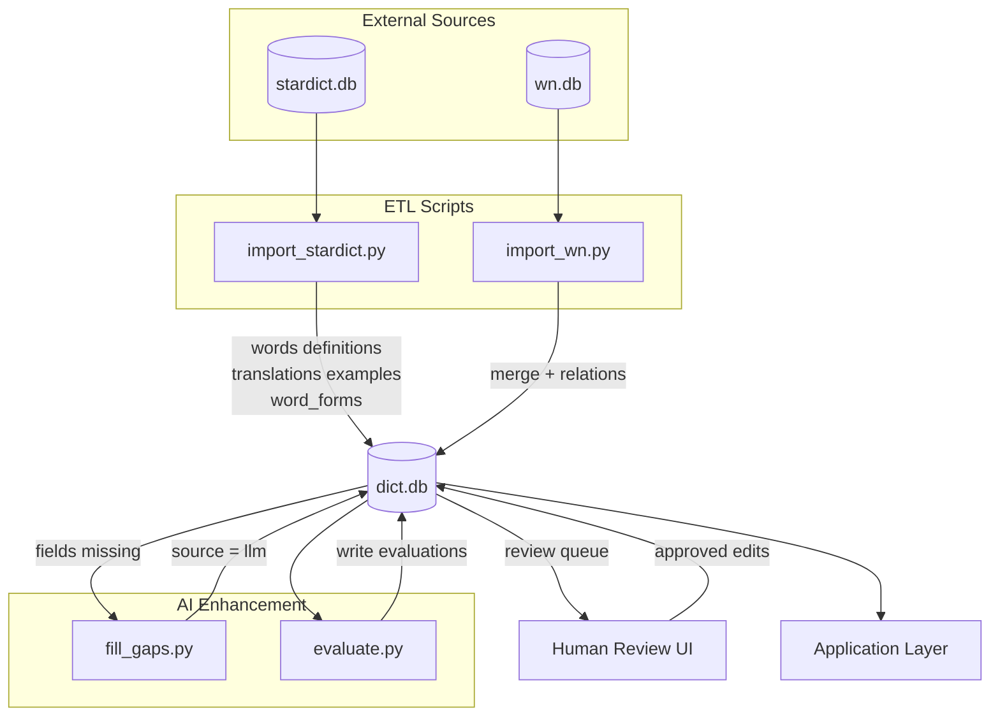

**核心关系规则：**

1. 外部源是基础，LLM 不覆盖外部源已有数据。LLM 只在两外部源都缺失某字段时才介入填充。
2. 人工是闸门，覆盖一切。人工修改过的数据，外部源更新时进入审批队列而非自动覆写。
3. LLM 的第二角色是质量评价。对已有数据打分、标记问题，辅助人工审核优先级排序。

### 1.3 数据质量判定

不用浮点数置信度（0.0~1.0 无法操作）。用 `source` + `reviewed` + `modified` 三个离散字段判定：

| 条件                                              | 质量等级 | 含义                   |
| ------------------------------------------------- | -------- | ---------------------- |
| `source='human'` 或 `modified=true`               | 最高     | 人工创建或修改过       |
| `source IN ('stardict','wn')` 且 `reviewed=true`  | 高       | 外部源数据，人工已确认 |
| `source IN ('stardict','wn')` 且 `reviewed=false` | 中       | 外部源数据，未审核     |
| `source='llm'` 且 `reviewed=true`                 | 中       | AI 生成，人工已确认    |
| `source='llm'` 且 `reviewed=false`                | 低       | AI 生成，未审核        |

查询排序 ORDER BY 规则：

```sql
ORDER BY
    CASE WHEN source = 'human' OR modified = true THEN 0
         WHEN source IN ('stardict','wn') AND reviewed = true  THEN 1
         WHEN source IN ('stardict','wn') AND reviewed = false THEN 2
         WHEN source = 'llm' AND reviewed = true  THEN 3
         ELSE 4
    END
```

**质量等级判定流程：**

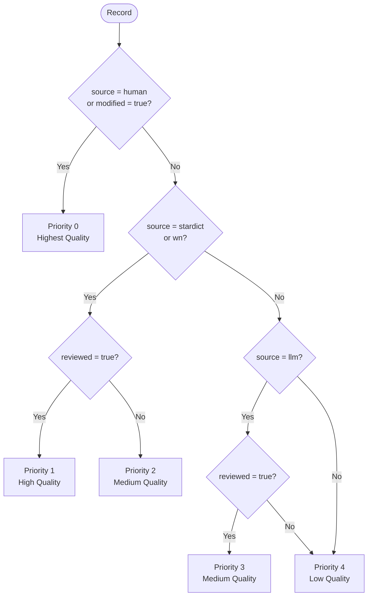

**记录状态迁移（reviewed / modified）：**

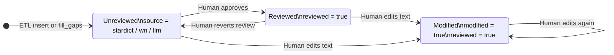

---

## 2. 枚举类型

所有枚举值统一用 PostgreSQL `ENUM` 类型定义，避免分散的 `CHECK` 约束，类型检查由数据库引擎完成。

```sql
-- 数据来源
CREATE TYPE data_source AS ENUM ('stardict', 'wn', 'llm', 'human');

-- 词性（遵循 WordNet/WN-LMF 规范）
-- n=名词, v=动词, a=形容词, r=副词, s=形容词卫星
CREATE TYPE pos_type AS ENUM ('n', 'v', 'a', 'r', 's');

-- 词形变化类型
CREATE TYPE form_type AS ENUM (
    'plural', 'past', 'past_participle',
    'present_participle', 'third_person',
    'comparative', 'superlative'
);

-- 人工操作类型
CREATE TYPE change_action AS ENUM (
    'create', 'update', 'delete', 'review', 'unreview'
);

-- 冲突审批状态
CREATE TYPE change_status AS ENUM ('pending', 'approved', 'rejected');

-- LLM 评价严重程度
CREATE TYPE severity_level AS ENUM ('critical', 'warning', 'info');

-- 导入模式
CREATE TYPE import_mode AS ENUM ('full', 'incremental');

-- 导入状态
CREATE TYPE import_status AS ENUM ('running', 'completed', 'failed');
```

---

## 3. 自动更新触发器

所有带 `updated_at` 的表共用同一个函数，不再依赖应用层手动更新。

```sql
CREATE OR REPLACE FUNCTION set_updated_at()
RETURNS TRIGGER AS $$
BEGIN
    NEW.updated_at = NOW();
    RETURN NEW;
END;
$$ LANGUAGE plpgsql;
```

每张有 `updated_at` 的表建表后附加：

```sql
CREATE TRIGGER trg_{table}_updated_at
BEFORE UPDATE ON {table}
FOR EACH ROW EXECUTE FUNCTION set_updated_at();
```

---

## 4. 表结构

### 4.1 表总览

| 表              | 用途                              | 预估行数 |
| --------------- | --------------------------------- | -------- |
| words           | 单词主表，一个 (word, pos) 一行   | ~200,000 |
| definitions     | 英文定义，一对多                  | ~250,000 |
| translations    | 中文翻译，一对多                  | ~180,000 |
| examples        | 例句，文本和翻译独立追踪          | ~80,000  |
| word_relations  | 语义关系（同义/反义/上下位/派生） | ~400,000 |
| word_forms      | 词形变化（复数/时态/比较级）      | ~100,000 |
| evaluations     | LLM 质量评价记录                  | ~变动    |
| pending_changes | 外部源更新产生的冲突审批队列      | ~0 起步  |
| change_log      | 人工操作审计日志                  | ~0 起步  |
| import_log      | 外部源导入运行记录                | ~10/年   |

### 4.2 words — 单词主表

一条记录 = 一个词形 + 可选词性。词性非必填（stardict 部分词条不标词性）。

**NULL 唯一性问题：** PostgreSQL 标准行为中 `NULL != NULL`，导致 `UNIQUE(word, pos)` 对多行 `pos=NULL` 失效。使用 PostgreSQL 15+ 的 `NULLS NOT DISTINCT` 选项解决。

```sql
CREATE TABLE words (
    id            BIGINT GENERATED ALWAYS AS IDENTITY PRIMARY KEY,
    word          CITEXT NOT NULL,              -- 词形 (lemma)，大小写不敏感
    pos           pos_type,                     -- 词性，可为 NULL（词性未知）
    pos_source    data_source,                  -- 该词性来自哪个源
    phonetic      TEXT,                         -- 音标 (IPA)
    phonetic_source data_source,               -- 音标来源
    audio         TEXT,                         -- 音频文件路径
    collins       SMALLINT DEFAULT 0            -- 柯林斯星级 0-5
                  CHECK (collins BETWEEN 0 AND 5),
    oxford        BOOLEAN DEFAULT false,        -- 是否为牛津 3000 核心词
    bnc           INTEGER,                      -- BNC 词频排名，越小越常用
    frq           INTEGER,                      -- COCA 词频排名，越小越常用
    tags          TEXT[] DEFAULT '{}',          -- 考试分类标签: {CET4,CET6,TOEFL,IELTS,GRE}
    exchange      JSONB,                        -- 词形变化: {"pl":"banks","past":"banked",...}
    detail        JSONB,                        -- stardict detail 原始扩展数据（保留备用）
    sources       TEXT[] NOT NULL DEFAULT '{}', -- 贡献来源: {stardict,wn}
    curated       BOOLEAN NOT NULL DEFAULT false, -- 人工是否审核过本条
    curated_at    TIMESTAMPTZ,
    created_at    TIMESTAMPTZ NOT NULL DEFAULT NOW(),
    updated_at    TIMESTAMPTZ NOT NULL DEFAULT NOW(),

    CONSTRAINT uq_word_pos UNIQUE NULLS NOT DISTINCT (word, pos)
);

-- 索引
CREATE INDEX idx_words_word    ON words (word);
CREATE INDEX idx_words_pos     ON words (pos);
CREATE INDEX idx_words_collins ON words (collins);
CREATE INDEX idx_words_bnc     ON words (bnc);
CREATE INDEX idx_words_frq     ON words (frq);
CREATE INDEX idx_words_curated ON words (curated);
CREATE INDEX idx_words_tags    ON words USING GIN (tags);
CREATE INDEX idx_words_sources ON words USING GIN (sources);

-- 触发器
CREATE TRIGGER trg_words_updated_at
BEFORE UPDATE ON words
FOR EACH ROW EXECUTE FUNCTION set_updated_at();
```

**字段说明：**

| 字段     | 来源                            | 说明                                                 |
| -------- | ------------------------------- | ---------------------------------------------------- |
| word     | 所有源共有                      | 词形本身，CITEXT 保证大小写不敏感匹配                |
| pos      | stardict(部分) / wn(全) / human | wn 的 pos 更完整；NULL 表示词性未知                  |
| phonetic | wn > stardict > human           | wn IPA 更规范                                        |
| audio    | stardict                        | wn 理论上也有但极少填充                              |
| collins  | stardict                        | 柯林斯词典独有                                       |
| oxford   | stardict                        | 牛津词典独有                                         |
| bnc      | stardict                        | 英国国家语料库词频                                   |
| frq      | stardict                        | 美国当代英语语料库词频                               |
| tags     | stardict                        | 考试分类标签，TEXT[] 数组                            |
| exchange | stardict + wn 补充              | stardict 为主，wn forms 表补充缺失，JSONB 可直接查键 |
| detail   | stardict                        | 原始扩展 JSON，不展开                                |
| sources  | ETL 自动维护                    | TEXT[] 数组，记录哪些上游提供了此词条                |

**curated 语义：**

- `false` = 未审核，字段值来自 ETL 自动导入。
- `true` = 已审核，人工已逐字段检查并确认。人工编辑任意字段时自动置 true。

**sources 操作示例：**

```sql
-- 追加来源（原子，无重复）
UPDATE words SET sources = array_append(sources, 'wn')
WHERE id = $1 AND NOT ('wn' = ANY(sources));

-- 删除来源
UPDATE words SET sources = array_remove(sources, 'stardict') WHERE id = $1;

-- 查询包含某来源的词
SELECT * FROM words WHERE 'wn' = ANY(sources);
```

### 4.3 definitions — 英文定义

每个词可有多条定义（不同来源的措辞可能不同）。`UNIQUE(word_id, text, source)` 允许相同文本来自不同来源，保留完整的来源信息。

```sql
CREATE TABLE definitions (
    id          BIGINT GENERATED ALWAYS AS IDENTITY PRIMARY KEY,
    word_id     BIGINT NOT NULL REFERENCES words(id) ON DELETE CASCADE,
    text        TEXT NOT NULL,
    source      data_source NOT NULL,
    reviewed    BOOLEAN NOT NULL DEFAULT false,
    reviewed_at TIMESTAMPTZ,
    modified    BOOLEAN NOT NULL DEFAULT false,  -- 人工是否修改过文本
    modified_at TIMESTAMPTZ,
    created_at  TIMESTAMPTZ NOT NULL DEFAULT NOW(),
    updated_at  TIMESTAMPTZ NOT NULL DEFAULT NOW(),

    UNIQUE (word_id, text, source)
);

CREATE INDEX idx_definitions_word     ON definitions (word_id);
CREATE INDEX idx_definitions_source   ON definitions (source);
CREATE INDEX idx_definitions_reviewed ON definitions (reviewed);

CREATE TRIGGER trg_definitions_updated_at
BEFORE UPDATE ON definitions
FOR EACH ROW EXECUTE FUNCTION set_updated_at();
```

**来源说明：**

| source   | 导入来源                 | 说明                             |
| -------- | ------------------------ | -------------------------------- |
| stardict | stardict.definition 字段 | 英文定义，通常简洁               |
| wn       | wn synset definition     | 英文定义，通常较完整             |
| llm      | fill_gaps.py             | 仅在 stardict 和 wn 都没有时补全 |
| human    | 人工新建                 | 人工输入的定义                   |

**modified 语义：**

- `false` = 文本未经人工修改，保持源导入时的原样。
- `true` = 人工编辑过文本内容。`source` 保持不变（记录最初来源），但查询优先级提升到最高。

**审核状态迁移：**

```
ETL 插入 (reviewed=false, modified=false)
    ├── 人工点击"通过" → reviewed=true,  reviewed_at=NOW()
    ├── 人工修改文本   → reviewed=true,  reviewed_at=NOW(), modified=true, modified_at=NOW()
    └── 人工撤回审核   → reviewed=false, reviewed_at=NULL
```

### 4.4 translations — 中文翻译

与 definitions 结构一致，增加 `language` 字段支持未来多语种扩展。

```sql
CREATE TABLE translations (
    id          BIGINT GENERATED ALWAYS AS IDENTITY PRIMARY KEY,
    word_id     BIGINT NOT NULL REFERENCES words(id) ON DELETE CASCADE,
    text        TEXT NOT NULL,
    language    TEXT NOT NULL DEFAULT 'zh',
    source      data_source NOT NULL,
    reviewed    BOOLEAN NOT NULL DEFAULT false,
    reviewed_at TIMESTAMPTZ,
    modified    BOOLEAN NOT NULL DEFAULT false,
    modified_at TIMESTAMPTZ,
    created_at  TIMESTAMPTZ NOT NULL DEFAULT NOW(),
    updated_at  TIMESTAMPTZ NOT NULL DEFAULT NOW(),

    UNIQUE (word_id, text, language, source)
);

CREATE INDEX idx_translations_word     ON translations (word_id);
CREATE INDEX idx_translations_source   ON translations (source);
CREATE INDEX idx_translations_reviewed ON translations (reviewed);

CREATE TRIGGER trg_translations_updated_at
BEFORE UPDATE ON translations
FOR EACH ROW EXECUTE FUNCTION set_updated_at();
```

**来源说明：**

| source   | 导入来源                  | 说明                                       |
| -------- | ------------------------- | ------------------------------------------ |
| stardict | stardict.translation 字段 | 中文翻译主来源                             |
| wn       | omw-cmn ILI 映射          | 通过跨语言索引找到的中文 lemma，非直接翻译 |
| llm      | fill_gaps.py              | 仅在 stardict 和 wn 都没有时补全           |
| human    | 人工新建                  | 人工输入的翻译                             |

### 4.5 examples — 例句

例句的英文文本和中文翻译有**独立**的审核追踪，两者可能来自不同源、分别审核。

```sql
CREATE TABLE examples (
    id               BIGINT GENERATED ALWAYS AS IDENTITY PRIMARY KEY,
    word_id          BIGINT NOT NULL REFERENCES words(id) ON DELETE CASCADE,
    text             TEXT NOT NULL,             -- 英文例句文本
    translation      TEXT,                      -- 例句的中文翻译（可为 NULL）
    -- 英文文本的追踪
    source           data_source NOT NULL,
    reviewed         BOOLEAN NOT NULL DEFAULT false,
    reviewed_at      TIMESTAMPTZ,
    modified         BOOLEAN NOT NULL DEFAULT false,
    modified_at      TIMESTAMPTZ,
    -- 中文翻译的独立追踪
    trans_source     data_source,
    trans_reviewed   BOOLEAN NOT NULL DEFAULT false,
    trans_reviewed_at TIMESTAMPTZ,
    trans_modified   BOOLEAN NOT NULL DEFAULT false,
    trans_modified_at TIMESTAMPTZ,
    created_at       TIMESTAMPTZ NOT NULL DEFAULT NOW(),
    updated_at       TIMESTAMPTZ NOT NULL DEFAULT NOW(),

    UNIQUE (word_id, text)
);

CREATE INDEX idx_examples_word     ON examples (word_id);
CREATE INDEX idx_examples_source   ON examples (source);
CREATE INDEX idx_examples_reviewed ON examples (reviewed);

CREATE TRIGGER trg_examples_updated_at
BEFORE UPDATE ON examples
FOR EACH ROW EXECUTE FUNCTION set_updated_at();
```

**独立追踪示例：**

```
例句行: word_id=1
  text="He cashed a check at the bank"    source='wn',  reviewed=true   (人工已确认)
  translation="他在银行兑现了支票"          trans_source='llm', trans_reviewed=false  (AI翻译，未审核)
```

**来源说明：**

| source   | 导入来源                          |
| -------- | --------------------------------- |
| stardict | stardict detail JSON 中解析的例句 |
| wn       | wn synset_examples 表             |
| llm      | fill_gaps.py 生成的例句           |
| human    | 人工新建的例句                    |

### 4.6 word_relations — 语义关系

统一存储所有词间语义关系。`related_word` 使用 `CITEXT` 与 `words.word` 保持大小写不敏感一致性；存词形文本而非 words.id，因为关联词可能不在本地词库中。

```sql
CREATE TABLE word_relations (
    id            BIGINT GENERATED ALWAYS AS IDENTITY PRIMARY KEY,
    word_id       BIGINT NOT NULL REFERENCES words(id) ON DELETE CASCADE,
    related_word  CITEXT NOT NULL,   -- 关联词形 (lemma)，大小写不敏感
    relation_type TEXT NOT NULL,     -- 关系类型，见下方列表
    source        data_source NOT NULL DEFAULT 'wn',
    reviewed      BOOLEAN NOT NULL DEFAULT false,
    reviewed_at   TIMESTAMPTZ,
    modified      BOOLEAN NOT NULL DEFAULT false,
    modified_at   TIMESTAMPTZ,
    created_at    TIMESTAMPTZ NOT NULL DEFAULT NOW(),
    updated_at    TIMESTAMPTZ NOT NULL DEFAULT NOW(),

    UNIQUE (word_id, related_word, relation_type)
);

CREATE INDEX idx_relations_word     ON word_relations (word_id);
CREATE INDEX idx_relations_related  ON word_relations (related_word);
CREATE INDEX idx_relations_type     ON word_relations (relation_type);
CREATE INDEX idx_relations_reviewed ON word_relations (reviewed);

CREATE TRIGGER trg_word_relations_updated_at
BEFORE UPDATE ON word_relations
FOR EACH ROW EXECUTE FUNCTION set_updated_at();
```

**关系类型（relation_type）完整列表：**

| 类别      | 类型                                                   | 含义                     |
| --------- | ------------------------------------------------------ | ------------------------ |
| 同义/反义 | synonym                                                | 同义词                   |
|           | antonym                                                | 反义词                   |
|           | similar                                                | 近似词                   |
| 上下位    | hypernym                                               | 上位词 (is-a)            |
|           | hyponym                                                | 下位词                   |
|           | instance_hypernym                                      | 实例上位词               |
|           | instance_hyponym                                       | 实例下位词               |
| 整体部分  | holo_part / mero_part                                  | 整体-部分                |
|           | holo_member / mero_member                              | 整体-成员                |
|           | holo_substance / mero_substance                        | 整体-物质                |
| 因果      | causes / is_caused_by                                  | 导致/被导致              |
| 蕴含      | entails / is_entailed_by                               | 蕴含/被蕴含              |
| 派生      | derivation                                             | 派生关系 (run → runner)  |
|           | participle                                             | 分词关系                 |
|           | pertainym                                              | 相关形容词 (sun → solar) |
| 领域      | domain_region / has_domain_region                      | 地域领域                 |
|           | domain_topic / has_domain_topic                        | 主题领域                 |
| 其他      | also, attribute, exemplifies, is_exemplified_by, other | 参见、属性、例证等       |

**设计要点：**

- wn 的 synset_relations 导入时展开：synset A {bank, depository} —hypernym→ synset B {institution}，展开为 bank→institution 和 depository→institution 两条关系。
- 关系是单向的。双向关系（如 synonym）在导入时写两行（A→B 和 B→A）。双向写入是**应用层责任**，ETL 结束后应断言验证对称性。

### 4.7 word_forms — 词形变化

```sql
CREATE TABLE word_forms (
    id          BIGINT GENERATED ALWAYS AS IDENTITY PRIMARY KEY,
    word_id     BIGINT NOT NULL REFERENCES words(id) ON DELETE CASCADE,
    form        TEXT NOT NULL,
    form_type   form_type NOT NULL,
    source      data_source NOT NULL DEFAULT 'stardict'
                CHECK (source IN ('stardict', 'wn', 'human')),
    reviewed    BOOLEAN NOT NULL DEFAULT false,
    reviewed_at TIMESTAMPTZ,
    modified    BOOLEAN NOT NULL DEFAULT false,
    modified_at TIMESTAMPTZ,
    created_at  TIMESTAMPTZ NOT NULL DEFAULT NOW(),
    updated_at  TIMESTAMPTZ NOT NULL DEFAULT NOW(),

    UNIQUE (word_id, form, form_type)
);

CREATE INDEX idx_wordforms_word ON word_forms (word_id);

CREATE TRIGGER trg_word_forms_updated_at
BEFORE UPDATE ON word_forms
FOR EACH ROW EXECUTE FUNCTION set_updated_at();
```

**form_type 与 stardict exchange JSON key 的映射：**

| exchange key | form_type          | 示例    |
| ------------ | ------------------ | ------- |
| pl           | plural             | banks   |
| past         | past               | banked  |
| pp           | past_participle    | banked  |
| ing          | present_participle | banking |
| 3rd          | third_person       | banks   |
| comp         | comparative        | bigger  |
| super        | superlative        | biggest |

### 4.8 evaluations — LLM 质量评价

LLM 对已有数据打分，辅助人工审核优先级排序。LLM 不直接改数据，评价结果写入此表。

`target_id` 无法使用外键约束（多态引用），改用触发器在插入时验证目标行存在。

```sql
CREATE TABLE evaluations (
    id           BIGINT GENERATED ALWAYS AS IDENTITY PRIMARY KEY,
    -- 评价目标
    target_table TEXT NOT NULL
                 CHECK (target_table IN ('definitions','translations','examples','word_relations')),
    target_id    BIGINT NOT NULL,               -- 目标表中的行 ID，由触发器验证存在性
    word_id      BIGINT NOT NULL REFERENCES words(id) ON DELETE CASCADE,
    -- 评价内容
    dimension    TEXT NOT NULL,                 -- 评价维度，见下方列表
    score        SMALLINT NOT NULL CHECK (score BETWEEN 1 AND 5),  -- 1=严重问题, 5=完美
    comment      TEXT,                          -- LLM 给出的理由
    suggestion   TEXT,                          -- LLM 建议的修正值（如有）
    severity     severity_level NOT NULL DEFAULT 'info',
    -- 状态
    reviewed     BOOLEAN NOT NULL DEFAULT false,
    reviewed_at  TIMESTAMPTZ,
    created_at   TIMESTAMPTZ NOT NULL DEFAULT NOW()
);

CREATE INDEX idx_evaluations_target   ON evaluations (target_table, target_id);
CREATE INDEX idx_evaluations_word     ON evaluations (word_id);
CREATE INDEX idx_evaluations_score    ON evaluations (score);
CREATE INDEX idx_evaluations_reviewed ON evaluations (reviewed);
```

**target_id 完整性触发器：**

```sql
CREATE OR REPLACE FUNCTION check_evaluation_target()
RETURNS TRIGGER AS $$
BEGIN
    CASE NEW.target_table
        WHEN 'definitions'   THEN PERFORM 1 FROM definitions   WHERE id = NEW.target_id;
        WHEN 'translations'  THEN PERFORM 1 FROM translations  WHERE id = NEW.target_id;
        WHEN 'examples'      THEN PERFORM 1 FROM examples      WHERE id = NEW.target_id;
        WHEN 'word_relations' THEN PERFORM 1 FROM word_relations WHERE id = NEW.target_id;
        ELSE RAISE EXCEPTION 'Unknown target_table: %', NEW.target_table;
    END CASE;
    IF NOT FOUND THEN
        RAISE EXCEPTION 'target_id % not found in table %', NEW.target_id, NEW.target_table;
    END IF;
    RETURN NEW;
END;
$$ LANGUAGE plpgsql;

CREATE TRIGGER trg_evaluations_target_check
BEFORE INSERT OR UPDATE ON evaluations
FOR EACH ROW EXECUTE FUNCTION check_evaluation_target();
```

**评价维度：**

| dimension                | 适用表                     | 评估内容                                   |
| ------------------------ | -------------------------- | ------------------------------------------ |
| translation_accuracy     | translations               | 中文翻译是否准确对应英文定义               |
| definition_completeness  | definitions                | 定义是否过简或过泛                         |
| example_naturalness      | examples                   | 例句是否地道                               |
| cross_source_consistency | definitions + translations | stardict 和 wn 对同一词的定义/翻译是否矛盾 |
| relation_accuracy        | word_relations             | 语义关系是否正确                           |
| form_correctness         | word_forms                 | 词形变化是否正确                           |

**severity 语义：**

| severity | 含义                 | 人工处理建议 |
| -------- | -------------------- | ------------ |
| critical | 明显错误，必须修正   | 优先处理     |
| warning  | 可能有问题，建议复查 | 有空处理     |
| info     | 参考信息             | 可选         |

**工作流：**

```
LLM 评价 → 写入 evaluations (reviewed=false)
    → 人工按 severity + score 排序，优先看 critical
    → 人工判断：同意评价 → 修改目标数据 + UPDATE evaluations SET reviewed=true
                 不同意   → 直接 UPDATE evaluations SET reviewed=true（跳过）
```

### 4.9 pending_changes — 数据源更新冲突队列

外部源更新时，与人工修改冲突的数据不自动覆写，而是进入此队列等待审批。

`status='rejected'` 的记录保留 90 天后由定期任务清理（防止无限膨胀）。

```sql
CREATE TABLE pending_changes (
    id            BIGINT GENERATED ALWAYS AS IDENTITY PRIMARY KEY,
    table_name    TEXT NOT NULL,         -- 目标表
    row_id        BIGINT,                -- 目标表中已有行的 ID；NULL 表示源新增了整行待确认
    word_id       BIGINT NOT NULL REFERENCES words(id) ON DELETE CASCADE,
    field         TEXT,                  -- 字段名 (仅 words 表使用，附属表为 NULL 表示整行)
    old_value     TEXT,                  -- dict.db 当前值
    new_value     TEXT,                  -- 新数据源建议值
    source        TEXT NOT NULL CHECK (source IN ('stardict', 'wn')),
    import_log_id BIGINT REFERENCES import_log(id),
    status        change_status NOT NULL DEFAULT 'pending',
    resolved_at   TIMESTAMPTZ,
    created_at    TIMESTAMPTZ NOT NULL DEFAULT NOW()
);

CREATE INDEX idx_pending_word   ON pending_changes (word_id);
CREATE INDEX idx_pending_status ON pending_changes (status);

-- 定期清理 rejected 超过 90 天的记录
-- 由外部 cron 或 pg_cron 扩展执行：
-- DELETE FROM pending_changes
-- WHERE status = 'rejected' AND resolved_at < NOW() - INTERVAL '90 days';
```

**与各表的对应关系：**

| table_name     | row_id | field    | 含义示例                                       |
| -------------- | ------ | -------- | ---------------------------------------------- |
| definitions    | 123    | NULL     | 定义行 id=123 的 text 在源中变了，但人工曾改过 |
| translations   | 456    | NULL     | 翻译行 id=456 的 text 在源中变了               |
| examples       | 789    | NULL     | 例句行 id=789 的 text 在源中变了               |
| words          | 10     | collins  | 词条 id=10 的 collins 从 3 变为 4              |
| words          | 10     | phonetic | 词条 id=10 的音标变了                          |
| word_relations | 55     | NULL     | 关系行 id=55 的文本在源中变了                  |

**审批流程：**

```
pending (默认)
    ├── 人工通过       → approved, applied to target table
    ├── 人工调整后通过  → approved, applied with manual edit
    └── 人工拒绝       → rejected, target table unchanged
```

### 4.10 change_log — 人工操作审计

ETL 自动导入不记日志（避免膨胀）。仅人工操作时写入。

```sql
CREATE TABLE change_log (
    id         BIGINT GENERATED ALWAYS AS IDENTITY PRIMARY KEY,
    table_name TEXT NOT NULL,          -- 目标表
    row_id     BIGINT NOT NULL,        -- 目标行 ID
    field      TEXT,                   -- 被修改的字段名；NULL 表示整行操作
    old_value  TEXT,                   -- 旧值；NULL 表示新建
    new_value  TEXT,                   -- 新值；NULL 表示删除
    action     change_action NOT NULL,
    operator   TEXT,                   -- 操作人 ID 或用户名
    changed_at TIMESTAMPTZ NOT NULL DEFAULT NOW()
);

CREATE INDEX idx_changelog_table_row ON change_log (table_name, row_id);
CREATE INDEX idx_changelog_changed_at ON change_log (changed_at);
```

### 4.11 import_log — 外部源导入记录

```sql
CREATE TABLE import_log (
    id                   BIGINT GENERATED ALWAYS AS IDENTITY PRIMARY KEY,
    source               TEXT NOT NULL CHECK (source IN ('stardict', 'wn')),
    source_version       TEXT,          -- 版本标识 (stardict=SHA256, wn=版本号如'2025+')
    mode                 import_mode NOT NULL,
    started_at           TIMESTAMPTZ NOT NULL DEFAULT NOW(),
    finished_at          TIMESTAMPTZ,
    duration_seconds     INTEGER        -- ETL 结束时写入，finished_at - started_at
                         GENERATED ALWAYS AS (
                             EXTRACT(EPOCH FROM (finished_at - started_at))::INTEGER
                         ) STORED,
    new_words            INTEGER DEFAULT 0,
    updated_words        INTEGER DEFAULT 0,
    new_definitions      INTEGER DEFAULT 0,
    updated_definitions  INTEGER DEFAULT 0,
    new_translations     INTEGER DEFAULT 0,
    updated_translations INTEGER DEFAULT 0,
    new_examples         INTEGER DEFAULT 0,
    updated_examples     INTEGER DEFAULT 0,
    new_relations        INTEGER DEFAULT 0,
    updated_relations    INTEGER DEFAULT 0,
    new_forms            INTEGER DEFAULT 0,
    updated_forms        INTEGER DEFAULT 0,
    conflicts            INTEGER DEFAULT 0,  -- 产生的 pending_changes 数量
    status               import_status NOT NULL DEFAULT 'running',
    error                TEXT
);
```

---

## 5. 完整建表 SQL

```sql
-- ============================================================
-- 依赖：先建 CITEXT 扩展
-- ============================================================
CREATE EXTENSION IF NOT EXISTS citext;

-- ============================================================
-- 枚举类型
-- ============================================================
CREATE TYPE data_source    AS ENUM ('stardict', 'wn', 'llm', 'human');
CREATE TYPE pos_type       AS ENUM ('n', 'v', 'a', 'r', 's');
CREATE TYPE form_type      AS ENUM (
    'plural', 'past', 'past_participle',
    'present_participle', 'third_person',
    'comparative', 'superlative'
);
CREATE TYPE change_action  AS ENUM ('create', 'update', 'delete', 'review', 'unreview');
CREATE TYPE change_status  AS ENUM ('pending', 'approved', 'rejected');
CREATE TYPE severity_level AS ENUM ('critical', 'warning', 'info');
CREATE TYPE import_mode    AS ENUM ('full', 'incremental');
CREATE TYPE import_status  AS ENUM ('running', 'completed', 'failed');

-- ============================================================
-- 共用触发器函数
-- ============================================================
CREATE OR REPLACE FUNCTION set_updated_at()
RETURNS TRIGGER AS $$
BEGIN NEW.updated_at = NOW(); RETURN NEW; END;
$$ LANGUAGE plpgsql;

CREATE OR REPLACE FUNCTION check_evaluation_target()
RETURNS TRIGGER AS $$
BEGIN
    CASE NEW.target_table
        WHEN 'definitions'    THEN PERFORM 1 FROM definitions    WHERE id = NEW.target_id;
        WHEN 'translations'   THEN PERFORM 1 FROM translations   WHERE id = NEW.target_id;
        WHEN 'examples'       THEN PERFORM 1 FROM examples       WHERE id = NEW.target_id;
        WHEN 'word_relations' THEN PERFORM 1 FROM word_relations WHERE id = NEW.target_id;
        ELSE RAISE EXCEPTION 'Unknown target_table: %', NEW.target_table;
    END CASE;
    IF NOT FOUND THEN
        RAISE EXCEPTION 'target_id % not found in table %', NEW.target_id, NEW.target_table;
    END IF;
    RETURN NEW;
END;
$$ LANGUAGE plpgsql;

-- ============================================================
-- 导入运行记录（被 pending_changes 引用，需先建）
-- ============================================================
CREATE TABLE import_log (
    id                   BIGINT GENERATED ALWAYS AS IDENTITY PRIMARY KEY,
    source               TEXT NOT NULL CHECK (source IN ('stardict', 'wn')),
    source_version       TEXT,
    mode                 import_mode NOT NULL,
    started_at           TIMESTAMPTZ NOT NULL DEFAULT NOW(),
    finished_at          TIMESTAMPTZ,
    duration_seconds     INTEGER GENERATED ALWAYS AS (
                             EXTRACT(EPOCH FROM (finished_at - started_at))::INTEGER
                         ) STORED,
    new_words            INTEGER DEFAULT 0,
    updated_words        INTEGER DEFAULT 0,
    new_definitions      INTEGER DEFAULT 0,
    updated_definitions  INTEGER DEFAULT 0,
    new_translations     INTEGER DEFAULT 0,
    updated_translations INTEGER DEFAULT 0,
    new_examples         INTEGER DEFAULT 0,
    updated_examples     INTEGER DEFAULT 0,
    new_relations        INTEGER DEFAULT 0,
    updated_relations    INTEGER DEFAULT 0,
    new_forms            INTEGER DEFAULT 0,
    updated_forms        INTEGER DEFAULT 0,
    conflicts            INTEGER DEFAULT 0,
    status               import_status NOT NULL DEFAULT 'running',
    error                TEXT
);

-- ============================================================
-- 单词主表
-- ============================================================
CREATE TABLE words (
    id              BIGINT GENERATED ALWAYS AS IDENTITY PRIMARY KEY,
    word            CITEXT NOT NULL,
    pos             pos_type,
    pos_source      data_source,
    phonetic        TEXT,
    phonetic_source data_source,
    audio           TEXT,
    collins         SMALLINT DEFAULT 0 CHECK (collins BETWEEN 0 AND 5),
    oxford          BOOLEAN DEFAULT false,
    bnc             INTEGER,
    frq             INTEGER,
    tags            TEXT[] DEFAULT '{}',
    exchange        JSONB,
    detail          JSONB,
    sources         TEXT[] NOT NULL DEFAULT '{}',
    curated         BOOLEAN NOT NULL DEFAULT false,
    curated_at      TIMESTAMPTZ,
    created_at      TIMESTAMPTZ NOT NULL DEFAULT NOW(),
    updated_at      TIMESTAMPTZ NOT NULL DEFAULT NOW(),

    CONSTRAINT uq_word_pos UNIQUE NULLS NOT DISTINCT (word, pos)
);
CREATE INDEX idx_words_word    ON words (word);
CREATE INDEX idx_words_pos     ON words (pos);
CREATE INDEX idx_words_collins ON words (collins);
CREATE INDEX idx_words_bnc     ON words (bnc);
CREATE INDEX idx_words_frq     ON words (frq);
CREATE INDEX idx_words_curated ON words (curated);
CREATE INDEX idx_words_tags    ON words USING GIN (tags);
CREATE INDEX idx_words_sources ON words USING GIN (sources);

CREATE TRIGGER trg_words_updated_at
BEFORE UPDATE ON words FOR EACH ROW EXECUTE FUNCTION set_updated_at();

-- ============================================================
-- 英文定义
-- ============================================================
CREATE TABLE definitions (
    id          BIGINT GENERATED ALWAYS AS IDENTITY PRIMARY KEY,
    word_id     BIGINT NOT NULL REFERENCES words(id) ON DELETE CASCADE,
    text        TEXT NOT NULL,
    source      data_source NOT NULL,
    reviewed    BOOLEAN NOT NULL DEFAULT false,
    reviewed_at TIMESTAMPTZ,
    modified    BOOLEAN NOT NULL DEFAULT false,
    modified_at TIMESTAMPTZ,
    created_at  TIMESTAMPTZ NOT NULL DEFAULT NOW(),
    updated_at  TIMESTAMPTZ NOT NULL DEFAULT NOW(),

    UNIQUE (word_id, text, source)
);
CREATE INDEX idx_definitions_word     ON definitions (word_id);
CREATE INDEX idx_definitions_source   ON definitions (source);
CREATE INDEX idx_definitions_reviewed ON definitions (reviewed);

CREATE TRIGGER trg_definitions_updated_at
BEFORE UPDATE ON definitions FOR EACH ROW EXECUTE FUNCTION set_updated_at();

-- ============================================================
-- 中文翻译
-- ============================================================
CREATE TABLE translations (
    id          BIGINT GENERATED ALWAYS AS IDENTITY PRIMARY KEY,
    word_id     BIGINT NOT NULL REFERENCES words(id) ON DELETE CASCADE,
    text        TEXT NOT NULL,
    language    TEXT NOT NULL DEFAULT 'zh',
    source      data_source NOT NULL,
    reviewed    BOOLEAN NOT NULL DEFAULT false,
    reviewed_at TIMESTAMPTZ,
    modified    BOOLEAN NOT NULL DEFAULT false,
    modified_at TIMESTAMPTZ,
    created_at  TIMESTAMPTZ NOT NULL DEFAULT NOW(),
    updated_at  TIMESTAMPTZ NOT NULL DEFAULT NOW(),

    UNIQUE (word_id, text, language, source)
);
CREATE INDEX idx_translations_word     ON translations (word_id);
CREATE INDEX idx_translations_source   ON translations (source);
CREATE INDEX idx_translations_reviewed ON translations (reviewed);

CREATE TRIGGER trg_translations_updated_at
BEFORE UPDATE ON translations FOR EACH ROW EXECUTE FUNCTION set_updated_at();

-- ============================================================
-- 例句
-- ============================================================
CREATE TABLE examples (
    id                BIGINT GENERATED ALWAYS AS IDENTITY PRIMARY KEY,
    word_id           BIGINT NOT NULL REFERENCES words(id) ON DELETE CASCADE,
    text              TEXT NOT NULL,
    translation       TEXT,
    source            data_source NOT NULL,
    reviewed          BOOLEAN NOT NULL DEFAULT false,
    reviewed_at       TIMESTAMPTZ,
    modified          BOOLEAN NOT NULL DEFAULT false,
    modified_at       TIMESTAMPTZ,
    trans_source      data_source,
    trans_reviewed    BOOLEAN NOT NULL DEFAULT false,
    trans_reviewed_at TIMESTAMPTZ,
    trans_modified    BOOLEAN NOT NULL DEFAULT false,
    trans_modified_at TIMESTAMPTZ,
    created_at        TIMESTAMPTZ NOT NULL DEFAULT NOW(),
    updated_at        TIMESTAMPTZ NOT NULL DEFAULT NOW(),

    UNIQUE (word_id, text)
);
CREATE INDEX idx_examples_word     ON examples (word_id);
CREATE INDEX idx_examples_source   ON examples (source);
CREATE INDEX idx_examples_reviewed ON examples (reviewed);

CREATE TRIGGER trg_examples_updated_at
BEFORE UPDATE ON examples FOR EACH ROW EXECUTE FUNCTION set_updated_at();

-- ============================================================
-- 语义关系
-- ============================================================
CREATE TABLE word_relations (
    id            BIGINT GENERATED ALWAYS AS IDENTITY PRIMARY KEY,
    word_id       BIGINT NOT NULL REFERENCES words(id) ON DELETE CASCADE,
    related_word  CITEXT NOT NULL,
    relation_type TEXT NOT NULL,
    source        data_source NOT NULL DEFAULT 'wn',
    reviewed      BOOLEAN NOT NULL DEFAULT false,
    reviewed_at   TIMESTAMPTZ,
    modified      BOOLEAN NOT NULL DEFAULT false,
    modified_at   TIMESTAMPTZ,
    created_at    TIMESTAMPTZ NOT NULL DEFAULT NOW(),
    updated_at    TIMESTAMPTZ NOT NULL DEFAULT NOW(),

    UNIQUE (word_id, related_word, relation_type)
);
CREATE INDEX idx_relations_word     ON word_relations (word_id);
CREATE INDEX idx_relations_related  ON word_relations (related_word);
CREATE INDEX idx_relations_type     ON word_relations (relation_type);
CREATE INDEX idx_relations_reviewed ON word_relations (reviewed);

CREATE TRIGGER trg_word_relations_updated_at
BEFORE UPDATE ON word_relations FOR EACH ROW EXECUTE FUNCTION set_updated_at();

-- ============================================================
-- 词形变化
-- ============================================================
CREATE TABLE word_forms (
    id          BIGINT GENERATED ALWAYS AS IDENTITY PRIMARY KEY,
    word_id     BIGINT NOT NULL REFERENCES words(id) ON DELETE CASCADE,
    form        TEXT NOT NULL,
    form_type   form_type NOT NULL,
    source      data_source NOT NULL DEFAULT 'stardict'
                CHECK (source IN ('stardict', 'wn', 'human')),
    reviewed    BOOLEAN NOT NULL DEFAULT false,
    reviewed_at TIMESTAMPTZ,
    modified    BOOLEAN NOT NULL DEFAULT false,
    modified_at TIMESTAMPTZ,
    created_at  TIMESTAMPTZ NOT NULL DEFAULT NOW(),
    updated_at  TIMESTAMPTZ NOT NULL DEFAULT NOW(),

    UNIQUE (word_id, form, form_type)
);
CREATE INDEX idx_wordforms_word ON word_forms (word_id);

CREATE TRIGGER trg_word_forms_updated_at
BEFORE UPDATE ON word_forms FOR EACH ROW EXECUTE FUNCTION set_updated_at();

-- ============================================================
-- LLM 质量评价
-- ============================================================
CREATE TABLE evaluations (
    id           BIGINT GENERATED ALWAYS AS IDENTITY PRIMARY KEY,
    target_table TEXT NOT NULL
                 CHECK (target_table IN ('definitions','translations','examples','word_relations')),
    target_id    BIGINT NOT NULL,
    word_id      BIGINT NOT NULL REFERENCES words(id) ON DELETE CASCADE,
    dimension    TEXT NOT NULL,
    score        SMALLINT NOT NULL CHECK (score BETWEEN 1 AND 5),
    comment      TEXT,
    suggestion   TEXT,
    severity     severity_level NOT NULL DEFAULT 'info',
    reviewed     BOOLEAN NOT NULL DEFAULT false,
    reviewed_at  TIMESTAMPTZ,
    created_at   TIMESTAMPTZ NOT NULL DEFAULT NOW()
);
CREATE INDEX idx_evaluations_target   ON evaluations (target_table, target_id);
CREATE INDEX idx_evaluations_word     ON evaluations (word_id);
CREATE INDEX idx_evaluations_score    ON evaluations (score);
CREATE INDEX idx_evaluations_reviewed ON evaluations (reviewed);

CREATE TRIGGER trg_evaluations_target_check
BEFORE INSERT OR UPDATE ON evaluations
FOR EACH ROW EXECUTE FUNCTION check_evaluation_target();

-- ============================================================
-- 数据源更新冲突队列
-- ============================================================
CREATE TABLE pending_changes (
    id            BIGINT GENERATED ALWAYS AS IDENTITY PRIMARY KEY,
    table_name    TEXT NOT NULL,
    row_id        BIGINT,
    word_id       BIGINT NOT NULL REFERENCES words(id) ON DELETE CASCADE,
    field         TEXT,
    old_value     TEXT,
    new_value     TEXT,
    source        TEXT NOT NULL CHECK (source IN ('stardict', 'wn')),
    import_log_id BIGINT REFERENCES import_log(id),
    status        change_status NOT NULL DEFAULT 'pending',
    resolved_at   TIMESTAMPTZ,
    created_at    TIMESTAMPTZ NOT NULL DEFAULT NOW()
);
CREATE INDEX idx_pending_word   ON pending_changes (word_id);
CREATE INDEX idx_pending_status ON pending_changes (status);

-- ============================================================
-- 人工操作审计
-- ============================================================
CREATE TABLE change_log (
    id         BIGINT GENERATED ALWAYS AS IDENTITY PRIMARY KEY,
    table_name TEXT NOT NULL,
    row_id     BIGINT NOT NULL,
    field      TEXT,
    old_value  TEXT,
    new_value  TEXT,
    action     change_action NOT NULL,
    operator   TEXT,
    changed_at TIMESTAMPTZ NOT NULL DEFAULT NOW()
);
CREATE INDEX idx_changelog_table_row  ON change_log (table_name, row_id);
CREATE INDEX idx_changelog_changed_at ON change_log (changed_at);
```

---

## 6. 实体关系图

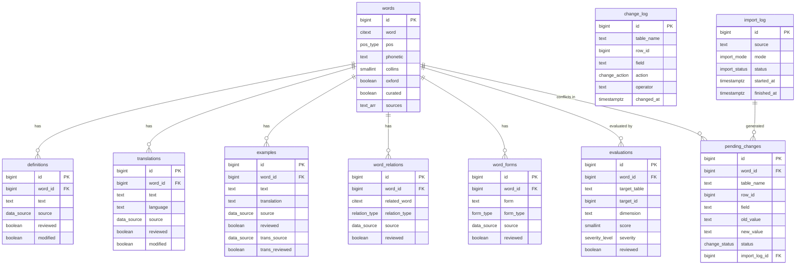

---

## 7. ETL 导入流程

### 7.1 总体流水线

```
1. import_stardict.py   →  words + definitions + translations + examples + word_forms
2. import_wn.py         →  合并 words + definitions + translations + examples + word_forms + word_relations
3. fill_gaps.py         →  LLM 补全 translations + examples.translation + definitions + examples.text
4. evaluate.py          →  LLM 评价已有数据质量，写入 evaluations
```

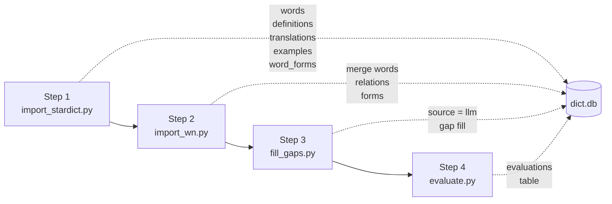

第二步是"合并"模式——wn 中已存在的词条更新补充字段，不新增重复行；wn 独有的词条新增。

### 7.2 字段导入优先级

合并时，**高优先级源可以覆盖低优先级源的数据**（仅限未人工审核的行）。

| 字段     | 优先级                | 说明                               |
| -------- | --------------------- | ---------------------------------- |
| pos      | wn > stardict         | wn pos 全覆盖且准确                |
| phonetic | wn > stardict         | wn IPA 更规范                      |
| audio    | stardict only         |                                    |
| collins  | stardict only         |                                    |
| oxford   | stardict only         |                                    |
| bnc      | stardict only         |                                    |
| frq      | stardict only         |                                    |
| tags     | stardict only         |                                    |
| exchange | stardict(主) + wn(补) | stardict 为主，wn forms 表补充缺失 |
| detail   | stardict only         |                                    |

合并规则：

- **已有值不被覆盖**，除非新源优先级更高。
- **curated=true 的 words 行**，任何 ETL 都不修改其字段。
- **reviewed=true 或 modified=true 的附属表行**，ETL 不覆写，差异进入 pending_changes。

### 7.3 pos 规范化

stardict 的 `pos` 字段格式为 `"n."` / `"n. 名词"` / `"vt."` 等，与 WordNet 的 `n/v/a/r/s` 不同。ETL 导入时统一转换：

```python
POS_MAP = {
    'n': 'n', 'n.': 'n',
    'v': 'v', 'v.': 'v', 'vt': 'v', 'vt.': 'v', 'vi': 'v', 'vi.': 'v',
    'a': 'a', 'adj': 'a', 'adj.': 'a',
    'adv': 'r', 'adv.': 'r',
    'prep': None, 'conj': None, 'pron': None,  # WordNet 不覆盖，置 NULL
}

def normalize_pos(raw: str) -> str | None:
    key = raw.strip().lower().split()[0]  # 取首词，去掉中文说明
    return POS_MAP.get(key, None)         # 未知词性置 NULL
```

**原则：** 宁可置 NULL，不写入错误 pos 值。

### 7.4 import_stardict.py

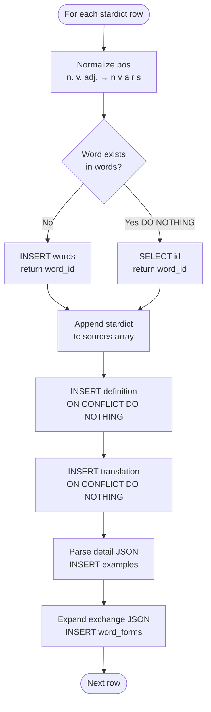

```python
for each row in stardict:
    # 1. 规范化 pos
    pos = normalize_pos(row.pos) if row.pos else None
    pos_source = 'stardict' if pos else None

    # 2. 插入或获取 words（NULLS NOT DISTINCT 保证 (word, NULL) 唯一）
    INSERT INTO words (word, pos, pos_source, phonetic, phonetic_source,
        audio, collins, oxford, bnc, frq, tags, exchange, detail, sources)
    VALUES ($word, $pos, $pos_source, $phonetic, 'stardict',
        $audio, $collins, $oxford::boolean, $bnc, $frq,
        $tags::text[], $exchange::jsonb, $detail::jsonb, ARRAY['stardict'])
    ON CONFLICT ON CONSTRAINT uq_word_pos DO NOTHING
    RETURNING id  →  word_id

    # 如果 DO NOTHING（已存在），SELECT id WHERE word=? AND pos IS NOT DISTINCT FROM ?

    # 3. 追加 sources（如果不包含）
    UPDATE words SET sources = array_append(sources, 'stardict')
    WHERE id = $word_id AND NOT ('stardict' = ANY(sources))

    # 4. 写 definitions / translations / examples / word_forms
    INSERT INTO definitions (word_id, text, source)
    VALUES ($word_id, $row.definition, 'stardict')
    ON CONFLICT (word_id, text, source) DO NOTHING

    INSERT INTO translations (word_id, text, language, source)
    VALUES ($word_id, $row.translation, 'zh', 'stardict')
    ON CONFLICT (word_id, text, language, source) DO NOTHING

    -- 解析 detail JSON 中的例句
    for each sentence in parse_examples(row.detail):
        INSERT INTO examples (word_id, text, translation, source, trans_source)
        VALUES ($word_id, $sentence.en, $sentence.zh, 'stardict',
                'stardict' IF $sentence.zh IS NOT NULL ELSE NULL)
        ON CONFLICT (word_id, text) DO NOTHING

    -- 展开 exchange JSONB
    for each (key, val) in row.exchange.items():
        form_type = EXCHANGE_MAP[key]
        INSERT INTO word_forms (word_id, form, form_type, source)
        VALUES ($word_id, $val, $form_type, 'stardict')
        ON CONFLICT (word_id, form, form_type) DO NOTHING
```

### 7.5 import_wn.py

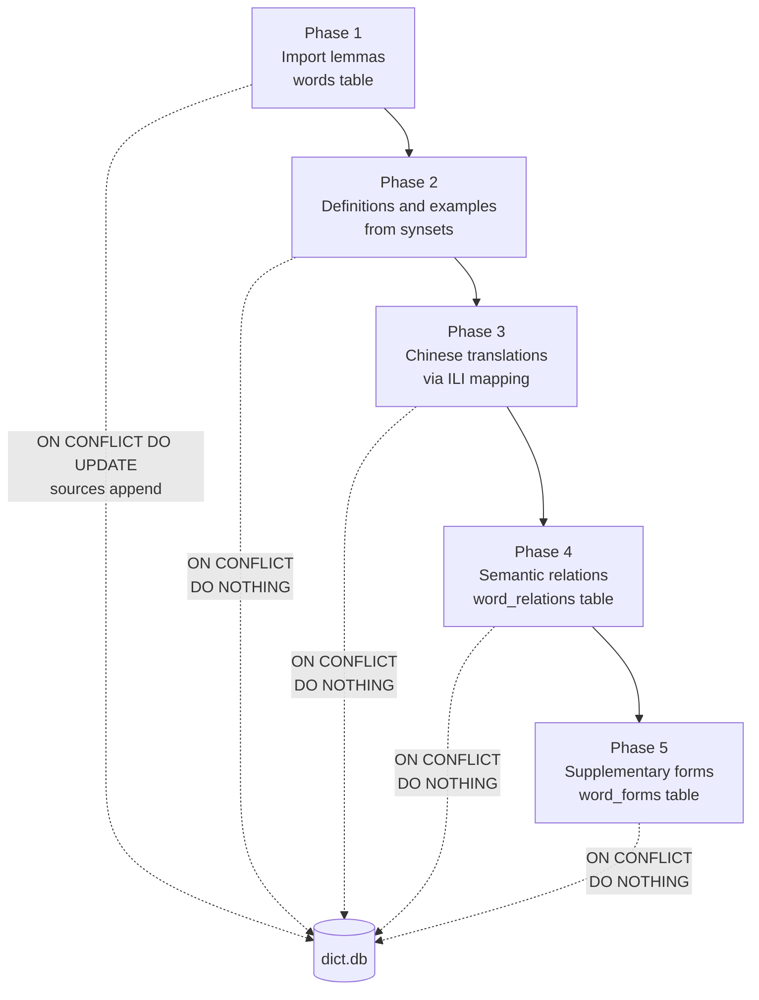

```python
# 阶段 1: 导入词形
for each entry in oewn + omw-cmn where pos IN ('n','v','a','r','s'):
    lemma = entry.forms[rank=0]
    pos   = entry.pos

    INSERT INTO words (word, pos, pos_source, phonetic, phonetic_source, sources)
    VALUES ($lemma, $pos, 'wn', $best_pron, 'wn' IF pron ELSE NULL, ARRAY['wn'])
    ON CONFLICT ON CONSTRAINT uq_word_pos DO UPDATE
        SET sources         = CASE WHEN NOT ('wn' = ANY(sources)) THEN array_append(sources,'wn') ELSE sources END,
            pos             = COALESCE(NULLIF(words.pos, NULL), EXCLUDED.pos),
            pos_source      = COALESCE(words.pos_source, 'wn'),
            phonetic        = COALESCE(words.phonetic, EXCLUDED.phonetic),
            phonetic_source = COALESCE(words.phonetic_source, EXCLUDED.phonetic_source)
    WHERE words.curated = false   -- curated=true 的行由 WHERE 过滤，不更新

    → word_id

# 阶段 2: 导入定义和例句 (仅 oewn)
for each synset in oewn:
    for each word_id in resolve_word_ids(synset.words):
        INSERT INTO definitions (word_id, text, source)
        VALUES ($word_id, $synset.definition, 'wn')
        ON CONFLICT (word_id, text, source) DO NOTHING

        for each example in synset.examples:
            INSERT INTO examples (word_id, text, source)
            VALUES ($word_id, $example, 'wn')
            ON CONFLICT (word_id, text) DO NOTHING

# 阶段 3: 中文翻译 (通过 ILI 跨语言映射)
for each cmn_synset in omw-cmn:
    en_synset = resolve by ILI
    if en_synset:
        for each en_word_id in en_synset.words:
            for each cmn_lemma in cmn_synset.words:
                INSERT INTO translations (word_id, text, language, source)
                VALUES ($en_word_id, $cmn_lemma, 'zh', 'wn')
                ON CONFLICT (word_id, text, language, source) DO NOTHING

# 阶段 4: 语义关系
for each synset_relation:
    type = relation_type
    for each (sw, tw) in cross(source_synset.words, target_synset.words):
        if sw != tw:
            INSERT INTO word_relations (word_id, related_word, relation_type, source)
            VALUES ($sw_id, $tw_lemma, $type, 'wn')
            ON CONFLICT (word_id, related_word, relation_type) DO NOTHING

            -- 对称关系（synonym/antonym）同时写反向
            if type IN ('synonym', 'antonym', 'similar'):
                INSERT INTO word_relations (word_id, related_word, relation_type, source)
                VALUES ($tw_id, $sw_lemma, $type, 'wn')
                ON CONFLICT DO NOTHING

# 阶段 5: 补充词形变化
for each form where rank > 0:
    form_type = infer_form_type(form, entry.pos)
    INSERT INTO word_forms (word_id, form, form_type, source)
    VALUES ($word_id, $form.text, $form_type, 'wn')
    ON CONFLICT (word_id, form, form_type) DO NOTHING
```

### 7.6 导入模式：首次 vs 重导

`ON CONFLICT DO NOTHING` 仅能防止**完全相同的行**重复插入。数据源更新后，同一 (word_id, source) 的文本可能变化，需额外处理：

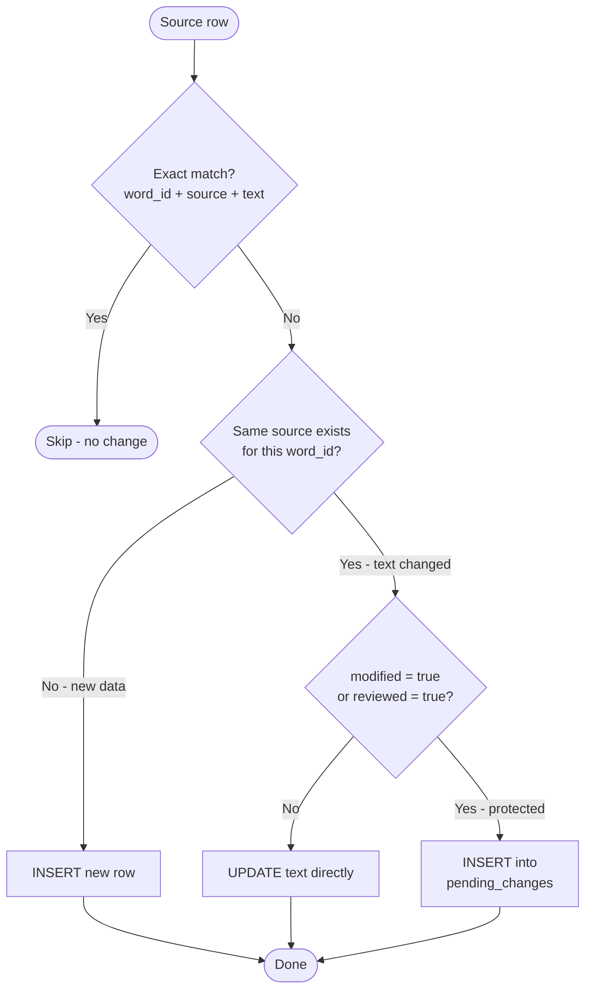

```python
for each source_row in source:
    # 精确匹配（text 未变）→ 跳过
    match = SELECT 1 FROM {table} WHERE word_id=$1 AND source=$2 AND text=$3
    if match: continue

    # 同源匹配（text 变了）
    same = SELECT * FROM {table} WHERE word_id=$1 AND source=$2

    if same:
        if same.modified = false AND same.reviewed = false:
            # 未人工修改 → 直接覆写
            UPDATE {table} SET text=$new, updated_at=NOW() WHERE id=$same.id
        else:
            # 人工修改过 → 生成冲突
            INSERT INTO pending_changes
                (table_name, row_id, word_id, old_value, new_value, source, import_log_id)
            VALUES ($table, $same.id, $word_id, $same.text, $new_text, $source, $import_id)
            ON CONFLICT DO NOTHING
    else:
        # 全新数据 → 直接插入
        INSERT INTO {table} (word_id, text, source, ...) VALUES (...)
        ON CONFLICT DO NOTHING
```

### 7.7 words 表冲突检测

粒度：字段级。`curated=true` 时逐字段对比。

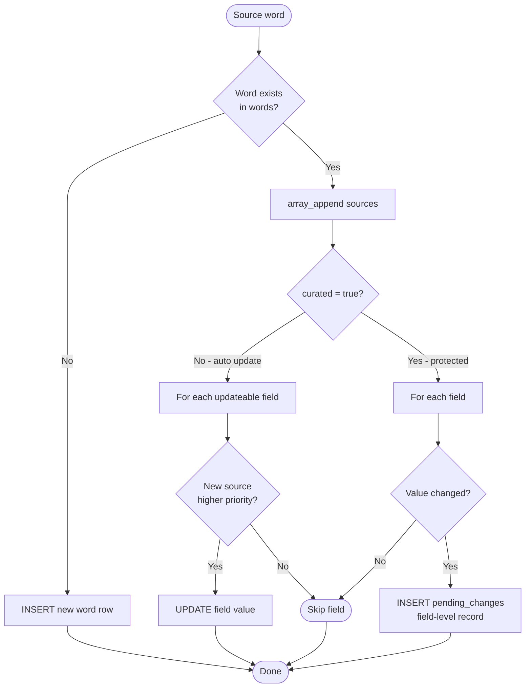

```python
for each source_row in source:
    existing = SELECT * FROM words
               WHERE word = $word AND pos IS NOT DISTINCT FROM $pos

    if existing:
        # 追加 sources
        UPDATE words SET sources = array_append(sources, $source_name)
        WHERE id=$existing.id AND NOT ($source_name = ANY(sources))

        if existing.curated = false:
            # 未审核 → 按优先级逐字段覆写
            for each field in [pos, phonetic, collins, oxford, bnc, frq, tags, exchange]:
                if source_has_field AND source_priority >= existing_priority:
                    UPDATE words SET {field}=$new WHERE id=$existing.id
        else:
            # 已审核 → 逐字段生成 pending_change
            for each field in [pos, phonetic, collins, oxford, bnc, frq, tags, exchange]:
                old_val = existing.{field}
                new_val = source_row.{field}
                if old_val IS DISTINCT FROM new_val AND new_val IS NOT NULL:
                    INSERT INTO pending_changes
                        (table_name, row_id, word_id, field, old_value, new_value, source, import_log_id)
                    VALUES ('words', $existing.id, $existing.id,
                            $field, $old_val::text, $new_val::text, $source_name, $import_id)
                    ON CONFLICT DO NOTHING
    else:
        INSERT INTO words (word, pos, ..., sources) VALUES ($word, $pos, ..., ARRAY[$source_name])
```

### 7.8 sources 删除处理

外部源删除数据时，dict 不做级联删除。只更新 `words.sources` 数组：

```python
# 找出在旧版源中存在但新版源中消失的词
words_from_source = SELECT id FROM words WHERE $source_name = ANY(sources)
words_in_current  = {all word ids from current source import}
deleted_ids       = words_from_source - words_in_current

for word_id in deleted_ids:
    UPDATE words
    SET sources = array_remove(sources, $source_name)
    WHERE id = $word_id
```

词条和附属数据保留。源删除不意味着数据失效——其他源可能仍提供同一词条。

### 7.9 冲突审批

人工在 UI 中逐条处理 `pending_changes`：

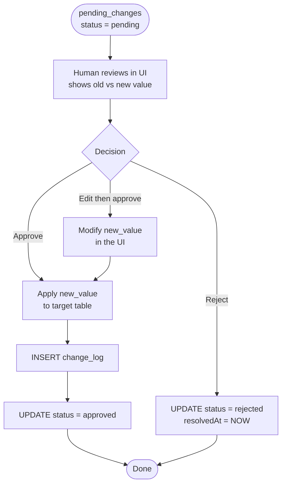

```python
# 审批通过（附属表，如 definitions / translations / examples）
UPDATE {table_name}
SET text = $new_value, modified = false, reviewed = true,
    reviewed_at = NOW(), updated_at = NOW()
WHERE id = $row_id

INSERT INTO change_log (table_name, row_id, field, old_value, new_value, action, operator)
SELECT table_name, row_id, field, old_value, new_value, 'update', $operator
FROM pending_changes WHERE id = $pc_id

UPDATE pending_changes SET status = 'approved', resolved_at = NOW() WHERE id = $pc_id

# 审批通过（words 表字段，需按字段类型转换）
UPDATE words SET {field} = $new_value::target_type, updated_at = NOW() WHERE id = $row_id
-- 同上写 change_log + 更新 pending_changes

# 审批拒绝
UPDATE pending_changes SET status = 'rejected', resolved_at = NOW() WHERE id = $pc_id
```

---

## 8. LLM 角色

LLM 在系统中有两个独立角色：**内容生成**（填充数据）和**质量评价**（审核数据）。两者不混在一条流水线中。

### 8.1 角色 A: 内容生成 (fill_gaps.py)

**触发时机：** ETL 导入完成后执行。

**原则：** 只在外部源都没提供数据时才生成，已有外部源数据的字段 LLM 不碰。幂等：若已有 LLM 生成数据（`source='llm'`）则跳过，不重复生成。

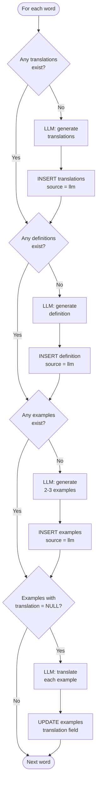

```python
def fill_gaps():
    for each word in words:
        # 1. 补中文翻译
        if not exists(SELECT 1 FROM translations WHERE word_id=$word.id):
            result = llm(f"Translate '{word.word}' ({word.pos}) to Chinese. "
                         "Comma-separated if multiple senses.")
            for each tr in parse_translations(result):
                INSERT INTO translations (word_id, text, language, source)
                VALUES ($word.id, $tr, 'zh', 'llm')
                ON CONFLICT DO NOTHING

        # 2. 补英文定义
        if not exists(SELECT 1 FROM definitions WHERE word_id=$word.id):
            result = llm(f"Define '{word.word}' ({word.pos}) in one concise English sentence.")
            INSERT INTO definitions (word_id, text, source)
            VALUES ($word.id, $result, 'llm')
            ON CONFLICT DO NOTHING

        # 3. 补例句
        if not exists(SELECT 1 FROM examples WHERE word_id=$word.id):
            result = llm(f"Write 2-3 example sentences for '{word.word}' ({word.pos}). "
                         "One per line.")
            for each sentence in result.splitlines():
                INSERT INTO examples (word_id, text, source)
                VALUES ($word.id, $sentence, 'llm')
                ON CONFLICT DO NOTHING

        # 4. 补例句中文翻译
        for each ex in SELECT * FROM examples WHERE word_id=$word.id AND translation IS NULL:
            result = llm(f"Translate to Chinese: '{ex.text}'")
            UPDATE examples
            SET translation=$result, trans_source='llm', trans_reviewed=false, updated_at=NOW()
            WHERE id=$ex.id
```

### 8.2 角色 B: 质量评价 (evaluate.py)

**触发时机：** 可独立运行，也可在 fill_gaps.py 后运行，或定期运行。

**原则：** LLM 只评价，不修改数据。评价结果写入 `evaluations` 表，人工审核后决定是否采纳。

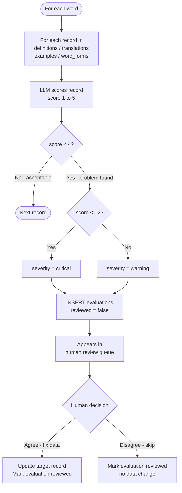

```python
def evaluate():
    for each word in words:
        # 1. 翻译准确度
        defs = SELECT text FROM definitions WHERE word_id=$word.id AND source IN ('stardict','wn')
        trs  = SELECT text FROM translations WHERE word_id=$word.id
        if defs and trs:
            result = llm(f"""
                Evaluate translation accuracy for '{word.word}'.
                English: {defs}
                Chinese: {trs}
                Score 1-5. JSON: {{"score":N,"comment":"...","suggestion":"..."}}
            """)
            if result.score < 4:
                INSERT INTO evaluations
                    (target_table, target_id, word_id, dimension, score,
                     comment, suggestion, severity)
                VALUES ('translations', $tr.id, $word.id, 'translation_accuracy',
                        $result.score, $result.comment, $result.suggestion,
                        'critical' IF result.score <= 2 ELSE 'warning')

        # 2. 定义完整度
        for each def in definitions WHERE word_id=$word.id:
            result = llm(...)
            if result.score < 4: INSERT INTO evaluations (...)

        # 3. 例句自然度
        for each ex in examples WHERE word_id=$word.id:
            result = llm(...)
            if result.score < 4: INSERT INTO evaluations (...)

        # 4. 跨源一致性
        if has both stardict and wn definitions:
            result = llm(...)
            if result.score < 4: INSERT INTO evaluations (...)
```

---

## 9. 查询示例

### 9.1 查单词完整信息

```sql
SELECT w.word, w.pos, w.phonetic, w.phonetic_source,
       w.collins, w.bnc, w.frq, w.tags, w.curated,
       d.text AS definition, d.source AS def_src, d.reviewed AS def_ok,
       t.text AS translation, t.source AS tr_src, t.reviewed AS tr_ok
FROM words w
LEFT JOIN definitions d ON d.word_id = w.id
LEFT JOIN translations t ON t.word_id = w.id
WHERE w.word = 'bank'
ORDER BY
    CASE WHEN d.source = 'human' OR d.modified THEN 0
         WHEN d.source IN ('stardict','wn') AND d.reviewed  THEN 1
         WHEN d.source IN ('stardict','wn') AND NOT d.reviewed THEN 2
         WHEN d.source = 'llm' AND d.reviewed THEN 3
         ELSE 4 END,
    CASE WHEN t.source = 'human' OR t.modified THEN 0
         WHEN t.source IN ('stardict','wn') AND t.reviewed  THEN 1
         WHEN t.source IN ('stardict','wn') AND NOT t.reviewed THEN 2
         WHEN t.source = 'llm' AND t.reviewed THEN 3
         ELSE 4 END;
```

### 9.2 查同义词

```sql
SELECT wr.related_word, wr.relation_type, wr.source, wr.reviewed
FROM word_relations wr
JOIN words w ON w.id = wr.word_id
WHERE w.word = 'happy' AND wr.relation_type = 'synonym'
ORDER BY
    CASE WHEN wr.source = 'human' OR wr.modified THEN 0 ELSE 1 END,
    wr.reviewed DESC;
```

### 9.3 查词形变化

```sql
SELECT form, form_type
FROM word_forms
WHERE word_id = (SELECT id FROM words WHERE word = 'run' AND pos = 'v');
```

### 9.4 查高频词

```sql
SELECT word, pos, frq, collins FROM words
WHERE frq IS NOT NULL
ORDER BY frq ASC
LIMIT 100;
```

### 9.5 查例句（含翻译状态）

```sql
SELECT e.text, e.translation,
       e.source, e.reviewed,
       e.trans_source, e.trans_reviewed
FROM examples e
JOIN words w ON w.id = e.word_id
WHERE w.word = 'bank'
ORDER BY
    CASE WHEN e.source = 'human' OR e.modified THEN 0
         WHEN e.source IN ('stardict','wn') AND e.reviewed THEN 1
         ELSE 2 END;
```

### 9.6 查待审核数据

```sql
-- LLM 未审核优先，外部源未审核次之
SELECT w.word, d.text, d.source, 'definition' AS type
FROM definitions d
JOIN words w ON w.id = d.word_id
WHERE d.reviewed = false AND d.source = 'llm'

UNION ALL

SELECT w.word, d.text, d.source, 'definition' AS type
FROM definitions d
JOIN words w ON w.id = d.word_id
WHERE d.reviewed = false AND d.source IN ('stardict','wn')

ORDER BY type, source;
```

### 9.7 查 LLM 评价

```sql
SELECT w.word, e.target_table, e.dimension,
       e.score, e.severity, e.comment, e.suggestion
FROM evaluations e
JOIN words w ON w.id = e.word_id
WHERE e.reviewed = false
ORDER BY
    CASE e.severity WHEN 'critical' THEN 0 WHEN 'warning' THEN 1 ELSE 2 END,
    e.score ASC;
```

### 9.8 查待审批冲突

```sql
SELECT w.word, pc.table_name, pc.field,
       pc.old_value, pc.new_value, pc.source, pc.created_at
FROM pending_changes pc
JOIN words w ON w.id = pc.word_id
WHERE pc.status = 'pending'
ORDER BY pc.source, pc.created_at;
```

### 9.9 审核操作 SQL

```sql
-- 审核通过一笔翻译
UPDATE translations
SET reviewed = true, reviewed_at = NOW(), updated_at = NOW()
WHERE id = $1;

INSERT INTO change_log (table_name, row_id, action, operator)
VALUES ('translations', $1, 'review', $operator);

-- 人工修改定义文本
UPDATE definitions
SET text = $new_text, modified = true, modified_at = NOW(),
    reviewed = true, reviewed_at = NOW(), updated_at = NOW()
WHERE id = $1;

INSERT INTO change_log (table_name, row_id, field, old_value, new_value, action, operator)
VALUES ('definitions', $1, 'text', $old_text, $new_text, 'update', $operator);

-- 人工新建翻译
INSERT INTO translations (word_id, text, language, source, reviewed, modified)
VALUES ($word_id, $text, 'zh', 'human', true, false);

-- 审批通过冲突（附属表）
UPDATE definitions
SET text        = (SELECT new_value FROM pending_changes WHERE id = $pc_id),
    modified    = false,
    reviewed    = true,
    reviewed_at = NOW(),
    updated_at  = NOW()
WHERE id = (SELECT row_id FROM pending_changes WHERE id = $pc_id);

INSERT INTO change_log (table_name, row_id, field, old_value, new_value, action, operator)
SELECT table_name, row_id, field, old_value, new_value, 'update', $operator
FROM pending_changes WHERE id = $pc_id;

UPDATE pending_changes
SET status = 'approved', resolved_at = NOW()
WHERE id = $pc_id;

-- 审批通过冲突（words 表字段，以 collins 为例）
UPDATE words
SET collins    = (SELECT new_value::SMALLINT FROM pending_changes WHERE id = $pc_id),
    updated_at = NOW()
WHERE id = (SELECT row_id FROM pending_changes WHERE id = $pc_id);

UPDATE pending_changes SET status = 'approved', resolved_at = NOW() WHERE id = $pc_id;

-- 审批拒绝
UPDATE pending_changes SET status = 'rejected', resolved_at = NOW() WHERE id = $pc_id;

-- 处理 LLM 评价（同意并修改）
UPDATE definitions
SET text        = (SELECT suggestion FROM evaluations WHERE id = $eval_id),
    modified    = true,
    modified_at = NOW(),
    reviewed    = true,
    reviewed_at = NOW(),
    updated_at  = NOW()
WHERE id = (SELECT target_id FROM evaluations WHERE id = $eval_id);

UPDATE evaluations SET reviewed = true, reviewed_at = NOW() WHERE id = $eval_id;

-- 处理 LLM 评价（不同意，跳过）
UPDATE evaluations SET reviewed = true, reviewed_at = NOW() WHERE id = $eval_id;
```

---

## 10. 数据统计估算

| 表              | 预估行数 | 说明                                       |
| --------------- | -------- | ------------------------------------------ |
| words           | ~200,000 | stardict 全量 + wn 补充                    |
| definitions     | ~250,000 | wn ~120k + stardict ~130k (去重后) + LLM   |
| translations    | ~180,000 | stardict 全量 + wn ILI 中文映射 + LLM      |
| examples        | ~80,000  | wn ~50k + stardict detail 解析 + LLM 生成  |
| word_relations  | ~400,000 | wn synset_relations 展开 + sense_relations |
| word_forms      | ~100,000 | stardict exchange 展开 + wn forms 补充     |
| evaluations     | ~变动    | 取决于评价覆盖范围和阈值                   |
| pending_changes | ~0 起步  | 仅在源更新且有人工修改时产生               |
| change_log      | ~0 起步  | 仅人工操作时写入                           |
| import_log      | ~10/年   | 每次导入一条记录                           |