# wn.db 数据库结构分析

## 概述

`wn.db` 是一个 SQLite 3.x 数据库，存储了 **Open English WordNet 2025+** 和 **Chinese Open WordNet (omw-cmn 1.4)** 两个词库。该数据库遵循 **WN-LMF**（WordNet Lexical Markup Framework）规范，通过 Python 库 `wn`（>=1.1.0）进行访问。

- **文件大小**: ~133 MB
- **词库 1**: Open English WordNet (oewn:2025+) — 英语 (en), CC BY 4.0
- **词库 2**: Chinese Open WordNet (omw-cmn:1.4) — 简体中文 (cmn-Hans), wordnet
- **表数量**: 26 张表
- **行数规模**: 英文约 120 万行，中文约 25 万行，合计约 145 万行

---

## 核心实体

### lexicon（词库）

一个完整的词汇数据库实例。本项目使用 **Open English WordNet 2025+**（标识符 `oewn:2025+`）。一个数据库可以包含多个词库，通过 `lexicon_dependencies` 和 `lexicon_extensions` 建立词库间的依赖/扩展关系。

### entry（词条）

一个独立的词或短语单元，是词汇的基本载体。如 `bank`、`give up`、`run` 均为独立的词条。每个词条有一个唯一 ID（如 `oewn-bank-n`）和一个词性（n/v/a/r/s，分别对应名词/动词/形容词/副词/形容词卫星）。

### form（词形）

词条的表面文字形式。一个词条可以有多个词形：

- 首选词形（lemma）：rank=0，如 `bank`
- 变体词形：如复数 `banks`、过去式 `ran` 等

`normalized_form` 是标准化后的形式（通常是小写），用于搜索匹配。

### synset（同义词集）

一组表达**同一概念**的同义词集合。这是 WordNet 的核心组织单元。例如 {bank, depository financial institution, banking concern} 构成一个同义词集，表达"银行-金融机构"这个概念。

每个 synset 关联：定义（definition）、例句（synset_examples）、词性（pos）、语义域分类（lexfile）、与其他 synset 的关系（上下位、整体部分等）、跨语言索引（ILI）。

### sense（义项）

连接 **entry** 和 **synset** 的桥梁，表示一个词条在**某个特定含义**下的用法。例如 `bank` 至少有 3 个义项：银行（金融机构）、河岸、倾斜（动词）。每个 sense 对应一个 synset。

### ILI（Inter-Lingual Index，跨语言索引）

一个独立于语言的概念标识符，用于在不同语言的 WordNet 之间建立概念映射。例如英文 synset {dog} 和中文 synset {狗} 指向同一个 ILI，从而可以跨语言查询。

ILI 有两种状态：
- **presupposed**（预设）：已验证的稳定 ILI
- **proposed**（提议）：待审核的新 ILI 映射（存放在 `proposed_ilis` 表中）

---

## ER 图

```mermaid
erDiagram
    entries["entries 词条 (225,222 rows)"] {
        int rowid PK "内部自增主键"
        string id "词条唯一标识，如 oewn-bank-n"
        int lexicon_rowid FK "所属词库的内部 ID"
        string pos "词性：n 名词/v 动词/a 形容词/r 副词/s 形卫星"
        json metadata "附加元数据（JSON）"
    }

    forms["forms 词形 (229,696 rows)"] {
        int rowid PK "内部自增主键"
        string id "词形唯一标识"
        int lexicon_rowid FK "所属词库的内部 ID"
        int entry_rowid FK "所属词条的内部 ID"
        string form "词形文本，如 bank"
        string normalized_form "标准化词形（通常小写），用于搜索匹配"
        string script "书写系统代码"
        int rank "排序权重，0 为首选词形（lemma）"
    }

    senses["senses 义项 (292,468 rows)"] {
        int rowid PK "内部自增主键"
        string id "义项唯一标识"
        int lexicon_rowid FK "所属词库的内部 ID"
        int entry_rowid FK "所属词条的内部 ID"
        int entry_rank "在该词条所有义项中的排序"
        int synset_rowid FK "所属同义词集的内部 ID"
        int synset_rank "在该同义词集所有义项中的排序"
        json metadata "附加元数据（JSON）"
    }

    synsets["synsets 同义词集 (162,876 rows)"] {
        int rowid PK "内部自增主键"
        string id "同义词集唯一标识，如 oewn-00001740-n"
        int lexicon_rowid FK "所属词库的内部 ID"
        int ili_rowid FK "跨语言索引 ID，用于多语言概念映射"
        string pos "词性：n/v/a/r/s"
        int lexfile_rowid FK "语义域分类 ID"
        json metadata "附加元数据（JSON）"
    }

    definitions["definitions 定义 (120,569 rows)"] {
        int rowid PK "内部自增主键"
        int lexicon_rowid FK "所属词库的内部 ID"
        int synset_rowid FK "所属同义词集的内部 ID"
        text definition "定义文本，如 a financial institution..."
        string language "语言标签（BCP-47），如 en"
        int sense_rowid FK "所属具体义项（可选）"
        json metadata "附加元数据（JSON）"
    }

    ilis["ilis 跨语言索引 (117,351 rows)"] {
        int rowid PK "内部自增主键"
        string id UK "ILI 唯一标识，如 i81364"
        int status_rowid FK "状态 ID（presupposed/proposed）"
        text definition "跨语言通用定义"
        json metadata "附加元数据（JSON）"
    }

    ili_statuses["ili_statuses ILI 状态 (2 rows)"] {
        int rowid PK "内部自增主键"
        string status UK "状态名称：presupposed 已确认 / proposed 待审核"
    }

    lexfiles["lexfiles 语义域 (45 rows)"] {
        int rowid PK "内部自增主键"
        string name UK "语义域名称，如 noun.group"
    }

    relation_types["relation_types 关系类型 (28 rows)"] {
        int rowid PK "内部自增主键"
        string type UK "关系类型名称，如 hypernym / hyponym"
    }

    synset_relations["synset_relations 同义词集关系 (297,172 rows)"] {
        int rowid PK "内部自增主键"
        int lexicon_rowid FK "所属词库的内部 ID"
        int source_rowid FK "源同义词集的内部 ID"
        int target_rowid FK "目标同义词集的内部 ID"
        int type_rowid FK "关系类型 ID"
        json metadata "附加元数据（JSON）"
    }

    sense_relations["sense_relations 义项关系 (122,054 rows)"] {
        int rowid PK "内部自增主键"
        int lexicon_rowid FK "所属词库的内部 ID"
        int source_rowid FK "源义项的内部 ID"
        int target_rowid FK "目标义项的内部 ID"
        int type_rowid FK "关系类型 ID"
        json metadata "附加元数据（JSON）"
    }

    sense_synset_relations["sense_synset_relations 义项-同义词集关系 (0 rows)"] {
        int rowid PK "内部自增主键"
        int lexicon_rowid FK "所属词库的内部 ID"
        int source_rowid FK "源义项的内部 ID"
        int target_rowid FK "目标同义词集的内部 ID"
        int type_rowid FK "关系类型 ID"
        json metadata "附加元数据（JSON）"
    }

    pronunciations["pronunciations 发音 (44,638 rows)"] {
        int form_rowid FK "所属词形的内部 ID"
        int lexicon_rowid FK "所属词库的内部 ID"
        text value "IPA 音标文本，如 ɡɪv"
        string variety "口音变体，如 US / GB"
        string notation "标音体系名称"
        bool phonemic "是否为音位标音（1=是，0=否）"
        text audio "发音音频文件 URL"
    }

    synset_examples["synset_examples 同义词集例句 (49,724 rows)"] {
        int rowid PK "内部自增主键"
        int lexicon_rowid FK "所属词库的内部 ID"
        int synset_rowid FK "所属同义词集的内部 ID"
        text example "例句文本"
        string language "语言标签（BCP-47）"
        json metadata "附加元数据（JSON）"
    }

    syntactic_behaviours["syntactic_behaviours 句法行为 (39 rows)"] {
        int rowid PK "内部自增主键"
        string id "句法行为标识，如 vtai / via"
        int lexicon_rowid FK "所属词库的内部 ID"
        string frame UK "句法框架模板，如 Somebody ----s something"
    }

    syntactic_behaviour_senses["syntactic_behaviour_senses 句法行为-义项关联 (41,650 rows)"] {
        int syntactic_behaviour_rowid FK "句法行为的内部 ID"
        int sense_rowid FK "义项的内部 ID"
    }

    adjpositions["adjpositions 形容词位置 (1,052 rows)"] {
        int sense_rowid FK "所属义项的内部 ID"
        string adjposition "句法位置：predicative 表语 / attributive 定语 / immediate_postnominal 紧接名词后"
    }

    proposed_ilis["proposed_ilis 提议的 ILI (3,213 rows)"] {
        int rowid PK "内部自增主键"
        int synset_rowid FK "提议来源同义词集的内部 ID"
        text definition "提议的跨语言通用定义"
        json metadata "附加元数据（JSON）"
    }

    counts["counts 频次统计 (0 rows)"] {
        int rowid PK "内部自增主键"
        int lexicon_rowid FK "所属词库的内部 ID"
        int sense_rowid FK "所属义项的内部 ID"
        int count "使用频次数值"
        json metadata "附加元数据（JSON）"
    }

    entry_index["entry_index 词条索引 (0 rows)"] {
        int entry_rowid FK "词条的内部 ID"
        string lemma "词元（lemma）文本"
    }

    tags["tags 词形标签 (0 rows)"] {
        int form_rowid FK "所属词形的内部 ID"
        int lexicon_rowid FK "所属词库的内部 ID"
        string tag "标签值"
        string category "标签类别"
    }

    lexicon_dependencies["lexicon_dependencies 词库依赖 (0 rows)"] {
        int dependent_rowid FK "依赖方词库的内部 ID"
        string provider_id "提供方词库 ID"
        string provider_version "提供方词库版本"
        string provider_url "提供方词库 URL"
        int provider_rowid FK "提供方词库的内部 ID（可选）"
    }

    lexicon_extensions["lexicon_extensions 词库扩展 (0 rows)"] {
        int extension_rowid FK "扩展方词库的内部 ID"
        string base_id "基础词库 ID"
        string base_version "基础词库版本"
        string base_url "基础词库 URL"
        int base_rowid FK "基础词库的内部 ID（可选）"
    }

    sense_examples["sense_examples 义项例句 (0 rows)"] {
        int rowid PK "内部自增主键"
        int lexicon_rowid FK "所属词库的内部 ID"
        int sense_rowid FK "所属义项的内部 ID"
        text example "例句文本"
        string language "语言标签（BCP-47）"
        json metadata "附加元数据（JSON）"
    }

    unlexicalized_senses["unlexicalized_senses 未词化义项 (0 rows)"] {
        int sense_rowid FK "标记为未词化的义项 ID"
    }

    unlexicalized_synsets["unlexicalized_synsets 未词化同义词集 (0 rows)"] {
        int synset_rowid FK "标记为未词化的同义词集 ID"
    }

    entries ||--o{ forms : "包含词形"
    entries ||--o{ senses : "拥有义项"

    forms ||--o{ pronunciations : "发音信息"

    senses ||--o{ sense_relations : "作为关系源/目标"
    senses ||--o{ sense_synset_relations : "作为关系源"
    senses ||--o{ syntactic_behaviour_senses : "句法行为"
    senses ||--o{ adjpositions : "形容词位置"
    senses }o--|| synsets : "属于同义词集"
    senses }o--|| definitions : "通过义项关联定义"

    synsets ||--o{ synset_relations : "作为关系源/目标"
    synsets ||--o{ sense_synset_relations : "作为关系目标"
    synsets ||--o{ definitions : "拥有定义"
    synsets ||--o{ synset_examples : "拥有例句"
    synsets ||--o{ proposed_ilis : "提议 ILI"
    synsets }o--|| ilis : "映射到跨语言索引"
    synsets }o--|| lexfiles : "语义域分类"

    ilis }o--|| ili_statuses : "拥有状态"

    synset_relations }o--|| relation_types : "关系类型"
    sense_relations }o--|| relation_types : "关系类型"
    sense_synset_relations }o--|| relation_types : "关系类型"

    syntactic_behaviour_senses }o--|| syntactic_behaviours : "引用句法行为"
```



---

## 贯穿示例：以 "bank"（银行）为主线

下面用 **bank** 的一个具体义项 ——"银行，金融机构"—— 串起 26 张表之间的完整关系链路。

### 起点：lexicon

一切数据的容器是词库 `oewn:2025+`：

```
lexicons.rowid = 1, specifier = 'oewn:2025+', language = 'en'
```

### entry → form：词条与词形

`bank` 作为一个名词词条存储于 `entries`，其首选词形（lemma）存储在 `forms`：

| 表 | 字段 | 值 |
|----|------|-----|
| entries | id | `oewn-bank-n` |
| entries | pos | `n` |
| forms | form | `bank` |
| forms | rank | `0`（首选词形/lemma） |

`bank` 还有一个动词词条 `oewn-bank-v`（pos=`v`），同样通过 `forms.entry_rowid` 关联到词形 `bank`。

### sense → synset → definition：义项、同义词集与定义

名词 `bank` 有 10 个义项（senses），每个义项属于一个 synset。选取"银行"义项：

| 表 | 字段 | 值 |
|----|------|-----|
| senses | id | `oewn-bank__1.14.00..` |
| senses | entry_rank | `2`（该词条的第 2 个义项） |
| senses | synset_rank | `1`（该 synset 中的排序位置） |
| synsets | id | `oewn-08437235-n` |
| definitions | definition | *a financial institution that accepts deposits and channels the money into lending activities* |

同时，这个 synset 还包含另外 3 个词条的义项，组成同义词集：

| synset_rank | form | entry_id |
|-------------|------|----------|
| 0 | depository financial institution | `oewn-depository_financial_institution-n` |
| 1 | **bank** | `oewn-bank-n` |
| 2 | banking concern | `oewn-banking_concern-n` |
| 3 | banking company | `oewn-banking_company-n` |

> 这展示了 **entry → sense → synset** 的多对多模式：一个 synset 通过多行 senses 聚合多个 entry，一个 entry 通过多行 senses 分散到多个 synset。

### lexfile：语义域分类

synset `oewn-08437235-n` 通过 `lexfile_rowid` 归入 `noun.group`（集合名词），表示"银行"在语义上属于一种机构/集合。45 个 lexfile 构成了 WordNet 的顶层语义分类。

### ILI：跨语言索引

synset 通过 `ili_rowid` 指向跨语言索引：

| 表 | 字段 | 值 |
|----|------|-----|
| ilis | id | `i81364` |
| ili_statuses | status | `presupposed`（已确认的稳定 ILI） |

未来如果中文 WordNet 中有一个 synset 也指向 `i81364`，就能实现"bank ↔ 银行"的跨语言映射。

### synset_relations：同义词集关系（层级结构）

基于 `oewn-08437235-n`，通过 `synset_relations` 构建上下位层级：

```
synset_relations: source_rowid → target_rowid (via relation_types)
```

| 关系类型 | 目标 synset | 目标定义 |
|----------|------------|---------|
| **hypernym** (上位词) | `oewn-08071473-n` | an institution that collects funds and invests them in financial assets |
| **holo_member** (整体-成员) | `oewn-08083327-n` | banks collectively |
| **hyponym** (下位词) | `oewn-08251549-n` | credit union |
| **hyponym** | `oewn-08435377-n` | a financial institution that accepts demand deposits and provides other services for the public |
| **hyponym** | …还有 10+ 个下位词 | (Federal Reserve bank, commercial bank, etc.) |

`relation_types` 表定义了 28 种关系类型，这三个关系使用了其中的 `hypernym`、`holo_member`、`hyponym`。

### sense_relations：义项关系（细粒度语义）

名词"银行"义项通过 `sense_relations` 派生了三个动词用法：

| 关系类型 | 目标 sense | 目标词 | 含义 |
|----------|-----------|--------|------|
| **derivation** (派生) | `oewn-bank__2.40.02..` | bank (v) | do business with a bank |
| **derivation** | `oewn-bank__2.40.01..` | bank (v) | be in the banking business |
| **derivation** | `oewn-bank__2.40.00..` | bank (v) | put into a bank account |

> `synset_relations` 连接 synset → synset（概念层级）；`sense_relations` 连接 sense → sense（具体词义间的关系），粒度更细。

### synset_examples：例句

每个 synset 可附带使用例句：

| example | language |
|---------|----------|
| *he cashed a check at the bank* | (null=en) |
| *that bank holds the mortgage on my home* | (null=en) |

### syntactic_behaviours：句法行为（动词）

动词 `bank` 的 8 个义项各自关联句法模式。通过 `syntactic_behaviour_senses`（sense → syntactic_behaviour 的关联表）：

| sense_id | 句法框架 | sb_id |
|----------|---------|-------|
| bank 的存钱义项 | Somebody ----s something | `vtai` (及物-有灵主语-无灵宾语) |
| bank 的开银行义项 | Somebody ----s | `via` (不及物-有灵主语) |
| bank 的倾斜义项 | Somebody ----s something | `vtai` |

### pronunciations：发音（补充示例）

并非所有词都有发音数据。以 **give** 为例：

| form | IPA | variety | phonemic |
|------|-----|---------|----------|
| give | ɡɪv | (null) | 0 |

`pronunciations` 通过 `form_rowid` 关联到具体的词形，支持 US/GB 等多种变体。

### adjpositions：形容词位置（补充示例）

形容词通过 `adjpositions` 标记句法位置。以 **able** 为例：

| form | adjposition |
|------|-------------|
| able | predicative |

### 空表的位置

`counts`、`entry_index`、`tags`、`sense_synset_relations`、`lexicon_dependencies`、`lexicon_extensions`、`unlexicalized_senses`、`unlexicalized_synsets` 等表在当前数据库中为空，但它们是 WN-LMF 规范预留的结构，供扩展使用（词频统计、词形标签、跨词库依赖等）。

### 完整关系链路图

```
lexicons (1) ──── oewn:2025+
  │
  ├── entries ──── oewn-bank-n (pos=n)
  │     │
  │     ├── forms ──── "bank" (rank=0) ──→ [pronunciations: IPA, 变体]
  │     │
  │     └── senses ──── oewn-bank__1.14.00.. (entry_rank=2, synset_rank=1)
  │           │
  │           ├── belongs_to → synsets ──── oewn-08437235-n (pos=n)
  │           │     │
  │           │     ├── lexfiles ──── noun.group
  │           │     ├── ilis ──── i81364 (status: presupposed)
  │           │     ├── definitions ──── "a financial institution that..."
  │           │     ├── synset_examples ──── "he cashed a check at the bank"
  │           │     ├── synset_relations ──→ hypernym → oewn-08071473-n
  │           │     │                    ──→ hyponym → oewn-08251549-n
  │           │     │                    ──→ holo_member → oewn-08083327-n
  │           │     │                    ──→ [relation_types: 28 种类型]
  │           │     │
  │           │     └── other senses (同义词集其他成员)
  │           │           └── depository financial institution / banking concern / banking company
  │           │
  │           ├── sense_relations ──→ derivation → bank (v) - "put into a bank account"
  │           │                   ──→ derivation → bank (v) - "do business with a bank"
  │           │
  │           └── syntactic_behaviour_senses ──→ vtai "Somebody ----s something"
  │                                           ──→ via  "Somebody ----s"
  │
  └── [其他表: counts, tags, entry_index, sense_synset_relations 等预留空表]
```

---

## 表结构详解

### 核心表

#### lexicons — 词库元信息

| 字段 | 类型 | 说明 |
|------|------|------|
| rowid | INTEGER PK | 内部自增主键 |
| specifier | TEXT UNIQUE | 词库标识符 `id:version`，如 `oewn:2025+` |
| id | TEXT | 用户面向 ID，如 `oewn` |
| label | TEXT | 显示名称，如 `Open English Wordnet` |
| language | TEXT | BCP-47 语言标签，如 `en`、`cmn-Hans` |
| email | TEXT | 联系邮箱 |
| license | TEXT | 许可证 URL |
| version | TEXT | 版本号 |
| url | TEXT | 项目 URL |
| citation | TEXT | 引用信息 |
| logo | TEXT | Logo URL |
| metadata | META | 附加元数据（JSON） |
| modified | BOOLEAN | 是否被修改：0 否 / 1 是 |

当前数据：2 行，oewn:2025+（英文）和 omw-cmn:1.4（中文）。

#### entries — 词条

| 字段 | 类型 | 说明 |
|------|------|------|
| rowid | INTEGER PK | 内部自增主键 |
| id | TEXT NOT NULL | 词条唯一标识，如 `oewn-bank-n` |
| lexicon_rowid | INTEGER FK → lexicons | 所属词库的内部 ID |
| pos | TEXT | 词性：`n` 名词 / `v` 动词 / `a` 形容词 / `r` 副词 / `s` 形容词卫星 |
| metadata | META | 附加元数据（JSON） |

唯一约束：`(id, lexicon_rowid)`。行数：225,222（英文 161,875 + 中文 63,347）。

#### forms — 词形

| 字段 | 类型 | 说明 |
|------|------|------|
| rowid | INTEGER PK | 内部自增主键 |
| id | TEXT | 词形唯一标识 |
| lexicon_rowid | INTEGER FK → lexicons | 所属词库的内部 ID |
| entry_rowid | INTEGER FK → entries | 所属词条的内部 ID |
| form | TEXT NOT NULL | 词形文本，如 `bank`、`banks` |
| normalized_form | TEXT | 标准化词形（小写等），用于搜索匹配 |
| script | TEXT | 书写系统代码 |
| rank | INTEGER DEFAULT 1 | 排序权重，0 为首选词形（lemma） |

唯一约束：`(entry_rowid, form, script)`。行数：229,696（英文 166,349 + 中文 63,347）。

#### synsets — 同义词集

| 字段 | 类型 | 说明 |
|------|------|------|
| rowid | INTEGER PK | 内部自增主键 |
| id | TEXT NOT NULL | 同义词集唯一标识，如 `oewn-00001740-n` |
| lexicon_rowid | INTEGER FK → lexicons | 所属词库的内部 ID |
| ili_rowid | INTEGER FK → ilis | 跨语言索引 ID，用于多语言概念映射 |
| pos | TEXT | 词性：`n`/`v`/`a`/`r`/`s` |
| lexfile_rowid | INTEGER FK → lexfiles | 语义域分类 ID |
| metadata | META | 附加元数据（JSON） |

行数：162,876（英文 120,564 + 中文 42,312）。ID 前缀：`oewn-`（英文）、`omw-cmn-`（中文）。

#### senses — 义项

| 字段 | 类型 | 说明 |
|------|------|------|
| rowid | INTEGER PK | 内部自增主键 |
| id | TEXT NOT NULL | 义项唯一标识 |
| lexicon_rowid | INTEGER FK → lexicons | 所属词库的内部 ID |
| entry_rowid | INTEGER FK → entries | 所属词条的内部 ID |
| entry_rank | INTEGER DEFAULT 1 | 在该词条所有义项中的排序 |
| synset_rowid | INTEGER FK → synsets | 所属同义词集的内部 ID |
| synset_rank | INTEGER DEFAULT 1 | 在该同义词集所有义项中的排序 |
| metadata | META | 附加元数据（JSON） |

行数：292,468（英文 212,659 + 中文 79,809）。Sense 是 Entry 和 Synset 之间的多对多关联表。

---

### 语义分类

#### lexfiles — 语义域

将 synset 按语义分成 45 个类别，继承自 Princeton WordNet 的分类体系：

| 分类名 | 含义 |
|------|------|
| adj.all | 所有形容词 |
| adj.pert | 关系形容词 |
| adj.ppl | 分词形容词 |
| adv.all | 所有副词 |
| noun.Tops | 顶级名词（最抽象的概念） |
| noun.act | 动作名词 |
| noun.animal | 动物名词 |
| noun.artifact | 人造物名词 |
| noun.attribute | 属性名词 |
| noun.body | 身体名词 |
| verb.body | 身体动作动词 |
| ... | （共 45 个） |

#### relation_types — 关系类型

定义了 28 种语义关系：

| 类别 | 类型 | 含义 |
|------|------|------|
| 上下位 | hypernym | 上位词（is-a 关系） |
| | hyponym | 下位词 |
| 实例 | instance_hypernym | 实例上位词 |
| | instance_hyponym | 实例下位词 |
| 整体部分 | holo_part / mero_part | 整体-部分 |
| | holo_member / mero_member | 整体-成员 |
| | holo_substance / mero_substance | 整体-物质 |
| 反义近似 | antonym | 反义词 |
| | similar | 近似词 |
| 因果 | causes / is_caused_by | 导致 / 被导致 |
| 蕴含 | entails / is_entailed_by | 蕴含 / 被蕴含 |
| 派生 | derivation | 派生关系（如 run → runner） |
| | participle | 分词关系 |
| | pertainym | 相关形容词（如 sun → solar） |
| 领域 | domain_region / has_domain_region | 地域领域 |
| | domain_topic / has_domain_topic | 主题领域 |
| 其他 | also, attribute, exemplifies, is_exemplified_by, other | 参见、属性、例证等 |

---

### 关系表

#### synset_relations — 同义词集关系

synset 之间的语义关系，构成 WordNet 的层级结构。例如：
`{dog}` —hypernym→ `{canine}` —hypernym→ `{carnivore}` —hypernym→ ... → `{entity}`

这是 WordNet 最核心的关系表，共 297,172 行。

| 字段 | 类型 | 说明 |
|------|------|------|
| rowid | INTEGER PK | 内部自增主键 |
| lexicon_rowid | INTEGER FK → lexicons | 所属词库的内部 ID |
| source_rowid | INTEGER FK → synsets | 源同义词集的内部 ID |
| target_rowid | INTEGER FK → synsets | 目标同义词集的内部 ID |
| type_rowid | INTEGER FK → relation_types | 关系类型 ID |
| metadata | META | 附加元数据（JSON） |

#### sense_relations — 义项关系

义项之间的语义关系，如反义关系（antonym）、派生关系（derivation）。粒度比 synset_relations 更细，关联到具体词条的特定含义。共 122,054 行。

| 字段 | 类型 | 说明 |
|------|------|------|
| rowid | INTEGER PK | 内部自增主键 |
| lexicon_rowid | INTEGER FK → lexicons | 所属词库的内部 ID |
| source_rowid | INTEGER FK → senses | 源义项的内部 ID |
| target_rowid | INTEGER FK → senses | 目标义项的内部 ID |
| type_rowid | INTEGER FK → relation_types | 关系类型 ID |
| metadata | META | 附加元数据（JSON） |

#### sense_synset_relations — 义项-同义词集关系

跨层级的关系，连接 sense 到 synset。当前表为空（预留结构）。

| 字段 | 类型 | 说明 |
|------|------|------|
| rowid | INTEGER PK | 内部自增主键 |
| lexicon_rowid | INTEGER FK → lexicons | 所属词库的内部 ID |
| source_rowid | INTEGER FK → senses | 源义项的内部 ID |
| target_rowid | INTEGER FK → synsets | 目标同义词集的内部 ID |
| type_rowid | INTEGER FK → relation_types | 关系类型 ID |
| metadata | META | 附加元数据（JSON） |

---

### 内容表

#### definitions — 定义

每个 synset 对应的文字定义。共 120,569 行。例如 synset {able} 的定义为：

> (usually followed by 'to') having the necessary means or skill or know-how or authority to do something

| 字段 | 类型 | 说明 |
|------|------|------|
| rowid | INTEGER PK | 内部自增主键 |
| lexicon_rowid | INTEGER FK → lexicons | 所属词库的内部 ID |
| synset_rowid | INTEGER FK → synsets | 所属同义词集的内部 ID |
| definition | TEXT | 定义文本 |
| language | TEXT | 语言标签（BCP-47），如 `en` |
| sense_rowid | INTEGER FK → senses | 所属具体义项（可选） |
| metadata | META | 附加元数据（JSON） |

#### synset_examples — 同义词集例句

为 synset 提供的使用例句。共 49,724 行。

| 字段 | 类型 | 说明 |
|------|------|------|
| rowid | INTEGER PK | 内部自增主键 |
| lexicon_rowid | INTEGER FK → lexicons | 所属词库的内部 ID |
| synset_rowid | INTEGER FK → synsets | 所属同义词集的内部 ID |
| example | TEXT | 例句文本 |
| language | TEXT | 语言标签（BCP-47） |
| metadata | META | 附加元数据（JSON） |

#### sense_examples — 义项例句

为具体义项提供的例句，粒度比 synset_examples 更细。当前为空。

| 字段 | 类型 | 说明 |
|------|------|------|
| rowid | INTEGER PK | 内部自增主键 |
| lexicon_rowid | INTEGER FK → lexicons | 所属词库的内部 ID |
| sense_rowid | INTEGER FK → senses | 所属义项的内部 ID |
| example | TEXT | 例句文本 |
| language | TEXT | 语言标签（BCP-47） |
| metadata | META | 附加元数据（JSON） |

---

### 跨语言索引 (ILI)

#### ili_statuses — ILI 状态

2 行：`presupposed`（已确认）、`proposed`（待审核）。

| 字段 | 类型 | 说明 |
|------|------|------|
| rowid | INTEGER PK | 内部自增主键 |
| status | TEXT UNIQUE | 状态名称：presupposed 已确认 / proposed 待审核 |

#### ilis — 跨语言索引

| 字段 | 类型 | 说明 |
|------|------|------|
| rowid | INTEGER PK | 内部自增主键 |
| id | TEXT UNIQUE NOT NULL | ILI 唯一标识，如 `i81364` |
| status_rowid | INTEGER FK → ili_statuses | 状态 ID |
| definition | TEXT | 跨语言通用定义 |
| metadata | META | 附加元数据（JSON） |

共 117,351 行。

#### proposed_ilis — 提议的 ILI

待审核的 ILI 映射提议，共 3,213 行。

| 字段 | 类型 | 说明 |
|------|------|------|
| rowid | INTEGER PK | 内部自增主键 |
| synset_rowid | INTEGER FK → synsets | 提议来源同义词集的内部 ID |
| definition | TEXT | 提议的跨语言通用定义 |
| metadata | META | 附加元数据（JSON） |

---

### 语音与语法

#### pronunciations — 发音

词形的 IPA 音标信息，支持不同口音变体（US/GB）。`phonemic=1` 表示音位标音（broad transcription）。共 44,638 行。

| 字段 | 类型 | 说明 |
|------|------|------|
| form_rowid | INTEGER FK → forms | 所属词形的内部 ID |
| lexicon_rowid | INTEGER FK → lexicons | 所属词库的内部 ID |
| value | TEXT | IPA 音标文本，如 `ɡɪv` |
| variety | TEXT | 口音变体，如 US / GB |
| notation | TEXT | 标音体系名称 |
| phonemic | BOOLEAN | 是否为音位标音：1 是 / 0 否 |
| audio | TEXT | 发音音频文件 URL |

#### syntactic_behaviours — 句法行为

描述动词在句子中的搭配模式（句型框架），共 39 种。每种行为描述一个主语/宾语的句法模式：

| ID | 框架 | 含义 |
|------|------|------|
| vtai | Somebody ----s something | 及物-有灵主语-无灵宾语 |
| vtii | Something ----s something | 及物-无灵主语-无灵宾语 |
| vii | Something ----s | 不及物-无灵主语 |
| via | Somebody ----s | 不及物-有灵主语 |
| via-inf | Somebody ----s INFINITIVE | 后接不定式 |
| via-that | Somebody ----s that CLAUSE | 后接 that 从句 |
| vtaa | Somebody ----s somebody | 及物-双有灵 |

命名规则：`v`=verb，`t`=transitive，`i`=intransitive，`a`=animate（有灵），`i`=inanimate（无灵）。例如 `vtaa` = verb transitive animate-animate（及物动词，主语宾语均为有灵）。

| 字段 | 类型 | 说明 |
|------|------|------|
| rowid | INTEGER PK | 内部自增主键 |
| id | TEXT | 句法行为标识，如 `vtai` / `via` |
| lexicon_rowid | INTEGER FK → lexicons | 所属词库的内部 ID |
| frame | TEXT UK | 句法框架模板，如 `Somebody ----s something` |

每个 sense 通过 `syntactic_behaviour_senses`（41,650 行）关联到其适用的句法行为模式。

#### syntactic_behaviour_senses — 句法行为-义项关联

连接 sense 与 syntactic_behaviours 的多对多关联表。

| 字段 | 类型 | 说明 |
|------|------|------|
| syntactic_behaviour_rowid | INTEGER FK → syntactic_behaviours | 句法行为的内部 ID |
| sense_rowid | INTEGER FK → senses | 义项的内部 ID |

#### adjpositions — 形容词位置

记录形容词的句法位置（如 predicative/attributive），共 1,052 行。

| 字段 | 类型 | 说明 |
|------|------|------|
| sense_rowid | INTEGER FK → senses | 所属义项的内部 ID |
| adjposition | TEXT | 句法位置：predicative 表语 / attributive 定语 / immediate_postnominal 紧接名词后 |

---

### 预留空表

以下表是 WN-LMF 规范定义的结构，当前数据中为空：

#### counts — 频次统计

| 字段 | 类型 | 说明 |
|------|------|------|
| rowid | INTEGER PK | 内部自增主键 |
| lexicon_rowid | INTEGER FK → lexicons | 所属词库的内部 ID |
| sense_rowid | INTEGER FK → senses | 所属义项的内部 ID |
| count | INTEGER | 使用频次数值 |
| metadata | META | 附加元数据（JSON） |

#### entry_index — 词条索引

| 字段 | 类型 | 说明 |
|------|------|------|
| entry_rowid | INTEGER FK → entries | 词条的内部 ID |
| lemma | TEXT | 词元（lemma）文本 |

#### tags — 词形标签

| 字段 | 类型 | 说明 |
|------|------|------|
| form_rowid | INTEGER FK → forms | 所属词形的内部 ID |
| lexicon_rowid | INTEGER FK → lexicons | 所属词库的内部 ID |
| tag | TEXT | 标签值 |
| category | TEXT | 标签类别 |

#### lexicon_dependencies — 词库依赖

| 字段 | 类型 | 说明 |
|------|------|------|
| dependent_rowid | INTEGER FK → lexicons | 依赖方词库的内部 ID |
| provider_id | TEXT | 提供方词库 ID |
| provider_version | TEXT | 提供方词库版本 |
| provider_url | TEXT | 提供方词库 URL |
| provider_rowid | INTEGER FK → lexicons | 提供方词库的内部 ID（可选） |

#### lexicon_extensions — 词库扩展

| 字段 | 类型 | 说明 |
|------|------|------|
| extension_rowid | INTEGER FK → lexicons | 扩展方词库的内部 ID |
| base_id | TEXT | 基础词库 ID |
| base_version | TEXT | 基础词库版本 |
| base_url | TEXT | 基础词库 URL |
| base_rowid | INTEGER FK → lexicons | 基础词库的内部 ID（可选） |

#### unlexicalized_senses — 未词化义项

| 字段 | 类型 | 说明 |
|------|------|------|
| sense_rowid | INTEGER FK → senses | 标记为未词化的义项 ID |

#### unlexicalized_synsets — 未词化同义词集

| 字段 | 类型 | 说明 |
|------|------|------|
| synset_rowid | INTEGER FK → synsets | 标记为未词化的同义词集 ID |

---

## 核心查询示例

### 查询某个词的所有义项

```sql
SELECT e.id, f.form, s.id AS synset_id, d.definition
FROM entries e
JOIN forms f ON f.entry_rowid = e.rowid AND f.rank = 0
JOIN senses se ON se.entry_rowid = e.rowid
JOIN synsets s ON se.synset_rowid = s.rowid
JOIN definitions d ON d.synset_rowid = s.rowid
WHERE f.form = 'bank';
```

### 查询某个同义词集的上位词

```sql
SELECT ss.id, d.definition
FROM synset_relations sr
JOIN synsets ss ON sr.target_rowid = ss.rowid
JOIN relation_types rt ON sr.type_rowid = rt.rowid
JOIN definitions d ON d.synset_rowid = ss.rowid
WHERE sr.source_rowid = (
    SELECT rowid FROM synsets WHERE id = 'oewn-09200144-n'
)
AND rt.type = 'hypernym';
```

### 查询某个同义词集包含的所有词形

```sql
SELECT f.form
FROM senses se
JOIN forms f ON f.entry_rowid = se.entry_rowid AND f.rank = 0
WHERE se.synset_rowid = (
    SELECT rowid FROM synsets WHERE id = 'oewn-09200144-n'
);
```

---

## 与 Python `wn` 库的对应关系

| wn API | 涉及的表 |
|--------|---------|
| `wn.Wordnet("oewn:2025+")` | lexicons |
| `wordnet.words()` | entries + forms |
| `wordnet.synsets()` | synsets |
| `wordnet.senses()` | senses |
| `synset.definition()` | definitions |
| `synset.examples()` | synset_examples |
| `synset.hypernyms()` | synset_relations (type=hypernym) |
| `synset.hyponyms()` | synset_relations (type=hyponym) |
| `synset.lemmas()` | senses → entries → forms |
| `sense.relations()` | sense_relations |
| `wordnet.ilis` | ilis |

---

## 中文 WordNet (omw-cmn)

### 概述

wn.db 中包含 **两个词库**（通过 `lexicons` 表管理）：

| rowid | id | label | language | version |
|-------|-----|-------|----------|---------|
| 1 | oewn | Open English Wordnet | en | 2025+ |
| 2 | omw-cmn | Chinese Open Wordnet | cmn-Hans | 1.4 |

中文词库是 **Open Multilingual WordNet** 的一部分，与英文词库共享同一套 WN-LMF 表结构，通过 `lexicon_rowid` 区分。

### 数据规模对比

| 表 | 英文 (oewn) | 中文 (omw-cmn) |
|----|------------|---------------|
| entries | 161,875 | 63,347 |
| forms | 166,349 | 63,347 |
| senses | 212,659 | 79,809 |
| synsets | 120,564 | 42,312 |
| definitions | 120,569 | 0 |
| synset_examples | 49,724 | 0 |
| synset_relations | 297,172 | 0 |
| sense_relations | 122,054 | 0 |

### 关键差异

**中文词库不包含定义、例句和语义关系。** 中文 synset 通过 **ILI（跨语言索引）** 与英文 synset 共享概念，定义和关系全部复用英文侧数据。

```
中文 synset ──(ili_rowid)──→ ILI ←──(ili_rowid)── 英文 synset
                                                        │
                                                        ├── definitions (英文定义)
                                                        ├── synset_relations (上下位等)
                                                        └── synset_examples (英文例句)
```

### 数据特点

- **一对多映射**：一个中文 synset 通过 ILI 对应一个英文 synset，但一个英文 synset 可能对应多个中文词条的 sense
- **词性分布**：中文词条覆盖 n（名词）、v（动词）、a（形容词）、r（副词）
- **lemma 即词形**：中文词条的 form 和 entry 一一对应（63,347 entries = 63,347 forms），不存在复数/时态等变体
- **无句法行为**：中文侧没有 `syntactic_behaviours` 数据

### 中英文跨语言查询示例

查中文词"银行"对应的英文同义词集和定义：

```sql
SELECT f_en.form, d.definition
FROM entries e_cmn
JOIN forms f_cmn ON f_cmn.entry_rowid = e_cmn.rowid AND f_cmn.rank = 0
JOIN senses se_cmn ON se_cmn.entry_rowid = e_cmn.rowid
JOIN synsets s_cmn ON se_cmn.synset_rowid = s_cmn.rowid
JOIN ilis i ON s_cmn.ili_rowid = i.rowid
JOIN synsets s_en ON s_en.ili_rowid = i.rowid AND s_en.lexicon_rowid = 1
JOIN senses se_en ON se_en.synset_rowid = s_en.rowid
JOIN entries e_en ON se_en.entry_rowid = e_en.rowid
JOIN forms f_en ON f_en.entry_rowid = e_en.rowid AND f_en.rank = 0
JOIN definitions d ON d.synset_rowid = s_en.rowid
WHERE f_cmn.form = '银行';
```

### ILI 作为跨语言桥梁

ILI 表（117,435 行）本身独立于语言，中文和英文 synset 通过指向同一个 ILI 建立概念映射。中文词库 42,312 个 synset 各自指向唯一的 ILI，其中：

- 部分 ILI 同时被中英文 synset 引用（可直接跨语言映射）
- 部分 ILI 仅被中文 synset 引用（中文独有的概念）
- 英文侧 120,564 个 synset 中的 42,312 个有中文映射，其余暂无

ILI 状态仍为 `presupposed`（已确认），中文 ILI 映射来自 OMW 项目发布的稳定版本。
